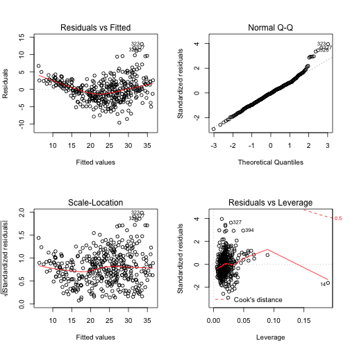
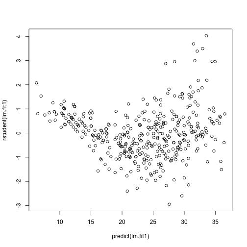

Chapter 3: Linear Regression: Exercises: Applied
================================================

8a.
---


```r
Auto = read.csv("../data/Auto.csv", header = T, na.strings = "?")
Auto = na.omit(Auto)
summary(Auto)
```

```
##       mpg         cylinders     displacement   horsepower   
##  Min.   : 9.0   Min.   :3.00   Min.   : 68   Min.   : 46.0  
##  1st Qu.:17.0   1st Qu.:4.00   1st Qu.:105   1st Qu.: 75.0  
##  Median :22.8   Median :4.00   Median :151   Median : 93.5  
##  Mean   :23.4   Mean   :5.47   Mean   :194   Mean   :104.5  
##  3rd Qu.:29.0   3rd Qu.:8.00   3rd Qu.:276   3rd Qu.:126.0  
##  Max.   :46.6   Max.   :8.00   Max.   :455   Max.   :230.0  
##                                                             
##      weight      acceleration       year        origin    
##  Min.   :1613   Min.   : 8.0   Min.   :70   Min.   :1.00  
##  1st Qu.:2225   1st Qu.:13.8   1st Qu.:73   1st Qu.:1.00  
##  Median :2804   Median :15.5   Median :76   Median :1.00  
##  Mean   :2978   Mean   :15.5   Mean   :76   Mean   :1.58  
##  3rd Qu.:3615   3rd Qu.:17.0   3rd Qu.:79   3rd Qu.:2.00  
##  Max.   :5140   Max.   :24.8   Max.   :82   Max.   :3.00  
##                                                           
##                  name    
##  amc matador       :  5  
##  ford pinto        :  5  
##  toyota corolla    :  5  
##  amc gremlin       :  4  
##  amc hornet        :  4  
##  chevrolet chevette:  4  
##  (Other)           :365
```

```r
attach(Auto)
lm.fit = lm(mpg ~ horsepower)
summary(lm.fit)
```

```
## 
## Call:
## lm(formula = mpg ~ horsepower)
## 
## Residuals:
##     Min      1Q  Median      3Q     Max 
## -13.571  -3.259  -0.344   2.763  16.924 
## 
## Coefficients:
##             Estimate Std. Error t value Pr(>|t|)    
## (Intercept) 39.93586    0.71750    55.7   <2e-16 ***
## horsepower  -0.15784    0.00645   -24.5   <2e-16 ***
## ---
## Signif. codes:  0 '***' 0.001 '**' 0.01 '*' 0.05 '.' 0.1 ' ' 1
## 
## Residual standard error: 4.91 on 390 degrees of freedom
## Multiple R-squared:  0.606,	Adjusted R-squared:  0.605 
## F-statistic:  600 on 1 and 390 DF,  p-value: <2e-16
```


### i.
Yes, there is a relationship between horsepower and mpg as deterined by
testing the null hypothesis of all regression coefficients equal to zero.
Since the F-statistic is far larger than 1 and the p-value of the F-statistic
is close to zero we can reject the null hypothesis and state there is a
statistically significant relationship between horsepower and mpg.

### ii.
The mean of horsepower is `104.4694` horses. The RSE of
the lm.fit was `4.906` which indicates a percentage error of
`4.6961`%. The $R^2$ of the lm.fit was
about `0.6059`, meaning `60.5948`%
of the variance in mpg is explained by horsepower.

### iii.
The relationship between mpg and horsepower is negative. The more horsepower
an automobile has the linear regression indicates the less mpg fuel efficiency
the automobile will have.

### iv.

```r
predict(lm.fit, data.frame(horsepower = c(98)), interval = "confidence")
```

```
##     fit   lwr   upr
## 1 24.47 23.97 24.96
```

```r
predict(lm.fit, data.frame(horsepower = c(98)), interval = "prediction")
```

```
##     fit   lwr   upr
## 1 24.47 14.81 34.12
```


8b.
---


```r
plot(horsepower, mpg)
abline(lm.fit)
```

 


8c.
---


```r
par(mfrow = c(2, 2))
plot(lm.fit)
```

 


Based on the residuals plots, there is some evidence of non-linearity.


9a.
---

```r
pairs(Auto)
```

 


9b.
---

```r
cor(subset(Auto, select = -name))
```

```
##                  mpg cylinders displacement horsepower  weight
## mpg           1.0000   -0.7776      -0.8051    -0.7784 -0.8322
## cylinders    -0.7776    1.0000       0.9508     0.8430  0.8975
## displacement -0.8051    0.9508       1.0000     0.8973  0.9330
## horsepower   -0.7784    0.8430       0.8973     1.0000  0.8645
## weight       -0.8322    0.8975       0.9330     0.8645  1.0000
## acceleration  0.4233   -0.5047      -0.5438    -0.6892 -0.4168
## year          0.5805   -0.3456      -0.3699    -0.4164 -0.3091
## origin        0.5652   -0.5689      -0.6145    -0.4552 -0.5850
##              acceleration    year  origin
## mpg                0.4233  0.5805  0.5652
## cylinders         -0.5047 -0.3456 -0.5689
## displacement      -0.5438 -0.3699 -0.6145
## horsepower        -0.6892 -0.4164 -0.4552
## weight            -0.4168 -0.3091 -0.5850
## acceleration       1.0000  0.2903  0.2127
## year               0.2903  1.0000  0.1815
## origin             0.2127  0.1815  1.0000
```


9c.
---

```r
lm.fit1 = lm(mpg ~ . - name, data = Auto)
summary(lm.fit1)
```

```
## 
## Call:
## lm(formula = mpg ~ . - name, data = Auto)
## 
## Residuals:
##    Min     1Q Median     3Q    Max 
## -9.590 -2.157 -0.117  1.869 13.060 
## 
## Coefficients:
##               Estimate Std. Error t value Pr(>|t|)    
## (Intercept)  -1.72e+01   4.64e+00   -3.71  0.00024 ***
## cylinders    -4.93e-01   3.23e-01   -1.53  0.12780    
## displacement  1.99e-02   7.51e-03    2.65  0.00844 ** 
## horsepower   -1.70e-02   1.38e-02   -1.23  0.21963    
## weight       -6.47e-03   6.52e-04   -9.93  < 2e-16 ***
## acceleration  8.06e-02   9.88e-02    0.82  0.41548    
## year          7.51e-01   5.10e-02   14.73  < 2e-16 ***
## origin        1.43e+00   2.78e-01    5.13  4.7e-07 ***
## ---
## Signif. codes:  0 '***' 0.001 '**' 0.01 '*' 0.05 '.' 0.1 ' ' 1
## 
## Residual standard error: 3.33 on 384 degrees of freedom
## Multiple R-squared:  0.821,	Adjusted R-squared:  0.818 
## F-statistic:  252 on 7 and 384 DF,  p-value: <2e-16
```


### i.
Yes, there is a relatioship between the predictors and the response by testing
the null hypothesis of whether all the regression coefficients are zero. The F
-statistic is far from 1 (with a small p-value), indicating evidence against
the null hypothesis.

### ii.
Looking at the p-values associated with each predictor's t-statistic, we see
that displacement, weight, year, and origin have a statistically significant relationship, while cylinders, horsepower, and acceleration do not.

### iii.
The regression coefficient for year, `0.7508`,
suggests that for every one year, mpg increases by the coefficient. In other
words, cars become more fuel efficient every year by almost 1 mpg / year.

9d.
---

```r
par(mfrow = c(2, 2))
plot(lm.fit1)
```

 

The fit does not appear to be accurate because there is a discernible curve
pattern to the residuals plots. From the leverage plot, point 14 appears to have
high leverage, although not a high magnitude residual.


```r
plot(predict(lm.fit1), rstudent(lm.fit1))
```

 

There are possible outliers as seen in the plot of studentized residuals
because there are data with a value greater than 3.

9e.
---

```r
lm.fit2 = lm(mpg ~ cylinders * displacement + displacement * weight)
summary(lm.fit2)
```

```
## 
## Call:
## lm(formula = mpg ~ cylinders * displacement + displacement * 
##     weight)
## 
## Residuals:
##     Min      1Q  Median      3Q     Max 
## -13.293  -2.518  -0.348   1.840  17.772 
## 
## Coefficients:
##                         Estimate Std. Error t value Pr(>|t|)    
## (Intercept)             5.26e+01   2.24e+00   23.52  < 2e-16 ***
## cylinders               7.61e-01   7.67e-01    0.99     0.32    
## displacement           -7.35e-02   1.67e-02   -4.40  1.4e-05 ***
## weight                 -9.89e-03   1.33e-03   -7.44  6.7e-13 ***
## cylinders:displacement -2.99e-03   3.43e-03   -0.87     0.38    
## displacement:weight     2.13e-05   5.00e-06    4.25  2.6e-05 ***
## ---
## Signif. codes:  0 '***' 0.001 '**' 0.01 '*' 0.05 '.' 0.1 ' ' 1
## 
## Residual standard error: 4.1 on 386 degrees of freedom
## Multiple R-squared:  0.727,	Adjusted R-squared:  0.724 
## F-statistic:  206 on 5 and 386 DF,  p-value: <2e-16
```

From the correlation matrix, I obtained the two highest correlated pairs and
used them in picking my interaction effects. From the p-values, we can see
that the interaction between displacement and weight is statistically
signifcant, while the interactiion between cylinders and displacement is not.

9f.
---

```r
lm.fit3 = lm(mpg ~ log(weight) + sqrt(horsepower) + acceleration + I(acceleration^2))
summary(lm.fit3)
```

```
## 
## Call:
## lm(formula = mpg ~ log(weight) + sqrt(horsepower) + acceleration + 
##     I(acceleration^2))
## 
## Residuals:
##     Min      1Q  Median      3Q     Max 
## -11.293  -2.508  -0.224   2.024  15.765 
## 
## Coefficients:
##                   Estimate Std. Error t value Pr(>|t|)    
## (Intercept)       178.3030    10.8045   16.50  < 2e-16 ***
## log(weight)       -14.7426     1.7399   -8.47  5.1e-16 ***
## sqrt(horsepower)   -1.8519     0.3600   -5.14  4.3e-07 ***
## acceleration       -2.1989     0.6390   -3.44  0.00064 ***
## I(acceleration^2)   0.0614     0.0186    3.31  0.00104 ** 
## ---
## Signif. codes:  0 '***' 0.001 '**' 0.01 '*' 0.05 '.' 0.1 ' ' 1
## 
## Residual standard error: 3.99 on 387 degrees of freedom
## Multiple R-squared:  0.741,	Adjusted R-squared:  0.739 
## F-statistic:  277 on 4 and 387 DF,  p-value: <2e-16
```

```r
par(mfrow = c(2, 2))
plot(lm.fit3)
```

 


```r
plot(predict(lm.fit3), rstudent(lm.fit3))
```

 

Apparently, from the p-values, the log(weight), sqrt(horsepower), and
acceleration^2 all have statistical significance of some sort. The residuals
plot has less of a discernible pattern than the plot of all linear regression
terms. The studentized residuals displays potential outliers (>3). The
leverage plot indicates more than three points with high leverage.

10a.
----


```r
library(ISLR)
```

```
## Attaching package: 'ISLR'
## 
## The following object is masked _by_ '.GlobalEnv':
## 
## Auto
```

```r
summary(Carseats)
```

```
##      Sales         CompPrice       Income       Advertising   
##  Min.   : 0.00   Min.   : 77   Min.   : 21.0   Min.   : 0.00  
##  1st Qu.: 5.39   1st Qu.:115   1st Qu.: 42.8   1st Qu.: 0.00  
##  Median : 7.49   Median :125   Median : 69.0   Median : 5.00  
##  Mean   : 7.50   Mean   :125   Mean   : 68.7   Mean   : 6.63  
##  3rd Qu.: 9.32   3rd Qu.:135   3rd Qu.: 91.0   3rd Qu.:12.00  
##  Max.   :16.27   Max.   :175   Max.   :120.0   Max.   :29.00  
##    Population      Price      ShelveLoc        Age         Education   
##  Min.   : 10   Min.   : 24   Bad   : 96   Min.   :25.0   Min.   :10.0  
##  1st Qu.:139   1st Qu.:100   Good  : 85   1st Qu.:39.8   1st Qu.:12.0  
##  Median :272   Median :117   Medium:219   Median :54.5   Median :14.0  
##  Mean   :265   Mean   :116                Mean   :53.3   Mean   :13.9  
##  3rd Qu.:398   3rd Qu.:131                3rd Qu.:66.0   3rd Qu.:16.0  
##  Max.   :509   Max.   :191                Max.   :80.0   Max.   :18.0  
##  Urban       US     
##  No :118   No :142  
##  Yes:282   Yes:258  
##                     
##                     
##                     
## 
```

```r
attach(Carseats)
lm.fit = lm(Sales ~ Price + Urban + US)
summary(lm.fit)
```

```
## 
## Call:
## lm(formula = Sales ~ Price + Urban + US)
## 
## Residuals:
##    Min     1Q Median     3Q    Max 
## -6.921 -1.622 -0.056  1.579  7.058 
## 
## Coefficients:
##             Estimate Std. Error t value Pr(>|t|)    
## (Intercept) 13.04347    0.65101   20.04  < 2e-16 ***
## Price       -0.05446    0.00524  -10.39  < 2e-16 ***
## UrbanYes    -0.02192    0.27165   -0.08     0.94    
## USYes        1.20057    0.25904    4.63  4.9e-06 ***
## ---
## Signif. codes:  0 '***' 0.001 '**' 0.01 '*' 0.05 '.' 0.1 ' ' 1
## 
## Residual standard error: 2.47 on 396 degrees of freedom
## Multiple R-squared:  0.239,	Adjusted R-squared:  0.234 
## F-statistic: 41.5 on 3 and 396 DF,  p-value: <2e-16
```


10b.
----
### Price
The linear regression suggests a relationship between price and sales given the
low p-value of the t-statistic. The coefficient states a negative
relationship between Price and Sales: as Price increases, Sales decreases.

### UrbanYes
The linear regression suggests that there isn't a relationship between the
location of the store and the number of sales based on the high p-value of the
t-statistic.

### USYes
The linear regression suggests there is a relationship between whether the store
is in the US or not and the amount of sales. The coefficient states a positive relationship between USYes and Sales: if the store is in the US, the sales will
increase by approximately 1201 units.

10c.
----
Sales = 13.04 + -0.05 Price + -0.02 UrbanYes + 1.20 USYes

10d.
----
Price and USYes, based on the p-values, F-statistic, and p-value of the
F-statistic.

10e.
----

```r
lm.fit2 = lm(Sales ~ Price + US)
summary(lm.fit2)
```

```
## 
## Call:
## lm(formula = Sales ~ Price + US)
## 
## Residuals:
##    Min     1Q Median     3Q    Max 
## -6.927 -1.629 -0.057  1.577  7.052 
## 
## Coefficients:
##             Estimate Std. Error t value Pr(>|t|)    
## (Intercept) 13.03079    0.63098   20.65  < 2e-16 ***
## Price       -0.05448    0.00523  -10.42  < 2e-16 ***
## USYes        1.19964    0.25846    4.64  4.7e-06 ***
## ---
## Signif. codes:  0 '***' 0.001 '**' 0.01 '*' 0.05 '.' 0.1 ' ' 1
## 
## Residual standard error: 2.47 on 397 degrees of freedom
## Multiple R-squared:  0.239,	Adjusted R-squared:  0.235 
## F-statistic: 62.4 on 2 and 397 DF,  p-value: <2e-16
```


10f.
----
Based on the RSE and R^2 of the linear regressions, they both fit the data
similarly, with linear regression from (e) fitting the data slightly better.

10g.
----

```r
confint(lm.fit2)
```

```
##                2.5 %  97.5 %
## (Intercept) 11.79032 14.2713
## Price       -0.06476 -0.0442
## USYes        0.69152  1.7078
```


10h.
----

```r
plot(predict(lm.fit2), rstudent(lm.fit2))
```

 

All studentized residuals appear to be bounded by -3 to 3, so not potential
outliers are suggested from the linear regression.


```r
par(mfrow = c(2, 2))
plot(lm.fit2)
```

 

There are a few observations that greatly exceed $(p+1)/n$ (`0.0076`) on the leverage-statistic plot that suggest that the corresponding points have high leverage.

11.
---


```r
set.seed(1)
x = rnorm(100)
y = 2 * x + rnorm(100)
```


11a.
----

```r
lm.fit = lm(y ~ x + 0)
summary(lm.fit)
```

```
## 
## Call:
## lm(formula = y ~ x + 0)
## 
## Residuals:
##    Min     1Q Median     3Q    Max 
## -1.915 -0.647 -0.177  0.506  2.311 
## 
## Coefficients:
##   Estimate Std. Error t value Pr(>|t|)    
## x    1.994      0.106    18.7   <2e-16 ***
## ---
## Signif. codes:  0 '***' 0.001 '**' 0.01 '*' 0.05 '.' 0.1 ' ' 1
## 
## Residual standard error: 0.959 on 99 degrees of freedom
## Multiple R-squared:  0.78,	Adjusted R-squared:  0.778 
## F-statistic:  351 on 1 and 99 DF,  p-value: <2e-16
```

The p-value of the t-statistic is near zero so the null hypothesis is rejected.

11b.
----

```r
lm.fit = lm(x ~ y + 0)
summary(lm.fit)
```

```
## 
## Call:
## lm(formula = x ~ y + 0)
## 
## Residuals:
##    Min     1Q Median     3Q    Max 
## -0.870 -0.237  0.103  0.286  0.894 
## 
## Coefficients:
##   Estimate Std. Error t value Pr(>|t|)    
## y   0.3911     0.0209    18.7   <2e-16 ***
## ---
## Signif. codes:  0 '***' 0.001 '**' 0.01 '*' 0.05 '.' 0.1 ' ' 1
## 
## Residual standard error: 0.425 on 99 degrees of freedom
## Multiple R-squared:  0.78,	Adjusted R-squared:  0.778 
## F-statistic:  351 on 1 and 99 DF,  p-value: <2e-16
```

The p-value of the t-statistic is near zero so the null hypothesis is rejected.

11c.
----
Both results in (a) and (b) reflect the same line created in 11a. In other
words, $y = 2x + \epsilon$ could also be written $x = 0.5 * (y - \epsilon)$.

11d.
----
$$
\begin{array}{cc}
t = \beta / SE(\beta) &
\beta = \frac {\sum{x_i y_i}} {\sum{x_i^2}} &
SE(\beta) = \sqrt{\frac {\sum{(y_i - x_i \beta)^2}} {(n-1) \sum{x_i^2}}}
\end{array}
\\
t = {\frac {\sum{x_i y_i}} {\sum{x_i^2}}}
    {\sqrt{\frac {(n-1) \sum{x_i^2}} {\sum{(y_i - x_i \beta)^2}}}}
\\
\frac {\sqrt{n-1} \sum{x_i y_i}}
      {\sqrt{\sum{x_i^2} \sum{(y_i - x_i \beta)^2}}}
\\
\frac {\sqrt{n-1} \sum{x_i y_i}}
      {\sqrt{\sum{x_i^2} \sum{(y_i^2 - 2 \beta x_i y_i  + x_i^2 \beta^2)}}}
\\
\frac {\sqrt{n-1} \sum{x_i y_i}}
      {\sqrt{\sum{x_i^2} \sum{y_i^2} - 
            \sum{x_i^2} \beta (2 \sum{x_i y_i} - \beta \sum{x_i^2})}}
\\
\frac {\sqrt{n-1} \sum{x_i y_i}}
      {\sqrt{\sum{x_i^2} \sum{y_i^2} - 
            \sum{x_i y_i} (2 \sum{x_i y_i} - \sum{x_i y_i})}}
\\
t = \frac {\sqrt{n-1} \sum{x_i y_i}} 
          {\sqrt{\sum{x_i^2} \sum{y_i^2} - (\sum{x_i y_i})^2 }}
$$


```r
(sqrt(length(x) - 1) * sum(x * y))/(sqrt(sum(x * x) * sum(y * y) - (sum(x * 
    y))^2))
```

```
## [1] 18.73
```

This is same as the t-statistic shown above.

11e.
----
If you swap t(x,y) as t(y,x), then you will find t(x,y) = t(y,x).

11f.
----

```r
lm.fit = lm(y ~ x)
lm.fit2 = lm(x ~ y)
summary(lm.fit)
```

```
## 
## Call:
## lm(formula = y ~ x)
## 
## Residuals:
##    Min     1Q Median     3Q    Max 
## -1.877 -0.614 -0.140  0.539  2.346 
## 
## Coefficients:
##             Estimate Std. Error t value Pr(>|t|)    
## (Intercept)  -0.0377     0.0970   -0.39      0.7    
## x             1.9989     0.1077   18.56   <2e-16 ***
## ---
## Signif. codes:  0 '***' 0.001 '**' 0.01 '*' 0.05 '.' 0.1 ' ' 1
## 
## Residual standard error: 0.963 on 98 degrees of freedom
## Multiple R-squared:  0.778,	Adjusted R-squared:  0.776 
## F-statistic:  344 on 1 and 98 DF,  p-value: <2e-16
```

```r
summary(lm.fit2)
```

```
## 
## Call:
## lm(formula = x ~ y)
## 
## Residuals:
##     Min      1Q  Median      3Q     Max 
## -0.9085 -0.2810  0.0627  0.2457  0.8574 
## 
## Coefficients:
##             Estimate Std. Error t value Pr(>|t|)    
## (Intercept)   0.0388     0.0427    0.91     0.37    
## y             0.3894     0.0210   18.56   <2e-16 ***
## ---
## Signif. codes:  0 '***' 0.001 '**' 0.01 '*' 0.05 '.' 0.1 ' ' 1
## 
## Residual standard error: 0.425 on 98 degrees of freedom
## Multiple R-squared:  0.778,	Adjusted R-squared:  0.776 
## F-statistic:  344 on 1 and 98 DF,  p-value: <2e-16
```

You can see the t-statistic is the same for the two linear regressions.

12a.
----
When the sum of the squares of the observed y-values are equal to the sum of the 
squares of the observed x-values.

12b.
----

```r
set.seed(1)
x = rnorm(100)
y = 2 * x
lm.fit = lm(y ~ x)
lm.fit2 = lm(x ~ y)
summary(lm.fit)
```

```
## 
## Call:
## lm(formula = y ~ x)
## 
## Residuals:
##       Min        1Q    Median        3Q       Max 
## -3.95e-16 -3.99e-17  2.60e-18  2.95e-17  4.03e-16 
## 
## Coefficients:
##              Estimate Std. Error   t value Pr(>|t|)    
## (Intercept) -4.44e-17   1.09e-17 -4.06e+00    1e-04 ***
## x            2.00e+00   1.22e-17  1.64e+17   <2e-16 ***
## ---
## Signif. codes:  0 '***' 0.001 '**' 0.01 '*' 0.05 '.' 0.1 ' ' 1
## 
## Residual standard error: 1.09e-16 on 98 degrees of freedom
## Multiple R-squared:     1,	Adjusted R-squared:     1 
## F-statistic: 2.71e+34 on 1 and 98 DF,  p-value: <2e-16
```

```r
summary(lm.fit2)
```

```
## 
## Call:
## lm(formula = x ~ y)
## 
## Residuals:
##       Min        1Q    Median        3Q       Max 
## -1.97e-16 -2.00e-17  1.29e-18  1.47e-17  2.01e-16 
## 
## Coefficients:
##              Estimate Std. Error   t value Pr(>|t|)    
## (Intercept) -2.22e-17   5.47e-18 -4.06e+00    1e-04 ***
## y            5.00e-01   3.04e-18  1.64e+17   <2e-16 ***
## ---
## Signif. codes:  0 '***' 0.001 '**' 0.01 '*' 0.05 '.' 0.1 ' ' 1
## 
## Residual standard error: 5.43e-17 on 98 degrees of freedom
## Multiple R-squared:     1,	Adjusted R-squared:     1 
## F-statistic: 2.71e+34 on 1 and 98 DF,  p-value: <2e-16
```

The regression coefficients are different for each linear regression.

12c.
----

```r
set.seed(1)
x = rnorm(100)
y = x
lm.fit = lm(y ~ x)
lm.fit2 = lm(x ~ y)
summary(lm.fit)
```

```
## 
## Call:
## lm(formula = y ~ x)
## 
## Residuals:
##       Min        1Q    Median        3Q       Max 
## -1.97e-16 -2.00e-17  1.29e-18  1.47e-17  2.01e-16 
## 
## Coefficients:
##              Estimate Std. Error   t value Pr(>|t|)    
## (Intercept) -2.22e-17   5.47e-18 -4.06e+00    1e-04 ***
## x            1.00e+00   6.08e-18  1.64e+17   <2e-16 ***
## ---
## Signif. codes:  0 '***' 0.001 '**' 0.01 '*' 0.05 '.' 0.1 ' ' 1
## 
## Residual standard error: 5.43e-17 on 98 degrees of freedom
## Multiple R-squared:     1,	Adjusted R-squared:     1 
## F-statistic: 2.71e+34 on 1 and 98 DF,  p-value: <2e-16
```

```r
summary(lm.fit2)
```

```
## 
## Call:
## lm(formula = x ~ y)
## 
## Residuals:
##       Min        1Q    Median        3Q       Max 
## -1.97e-16 -2.00e-17  1.29e-18  1.47e-17  2.01e-16 
## 
## Coefficients:
##              Estimate Std. Error   t value Pr(>|t|)    
## (Intercept) -2.22e-17   5.47e-18 -4.06e+00    1e-04 ***
## y            1.00e+00   6.08e-18  1.64e+17   <2e-16 ***
## ---
## Signif. codes:  0 '***' 0.001 '**' 0.01 '*' 0.05 '.' 0.1 ' ' 1
## 
## Residual standard error: 5.43e-17 on 98 degrees of freedom
## Multiple R-squared:     1,	Adjusted R-squared:     1 
## F-statistic: 2.71e+34 on 1 and 98 DF,  p-value: <2e-16
```

(*) This is a bit contrived so I am not sure about the answer. I'm not sure how
else I could reach the condition as specified in 12a.

13a.
----

```r
set.seed(1)
x = rnorm(100)
```


13b.
----

```r
eps = rnorm(100, 0, 0.25)
```


13c.
----

```r
y = -1 + 0.5 * x + eps
```

y is of length 100. $\beta_0$ is -1, $\beta_1$ is 0.5.

13d.
----

```r
plot(x, y)
```

 

I observe a linear relationship between x and y with a positive slope, with a 
variance as is to be expected.

13e.
----

```r
lm.fit = lm(y ~ x)
summary(lm.fit)
```

```
## 
## Call:
## lm(formula = y ~ x)
## 
## Residuals:
##     Min      1Q  Median      3Q     Max 
## -0.4692 -0.1534 -0.0349  0.1349  0.5865 
## 
## Coefficients:
##             Estimate Std. Error t value Pr(>|t|)    
## (Intercept)  -1.0094     0.0242   -41.6   <2e-16 ***
## x             0.4997     0.0269    18.6   <2e-16 ***
## ---
## Signif. codes:  0 '***' 0.001 '**' 0.01 '*' 0.05 '.' 0.1 ' ' 1
## 
## Residual standard error: 0.241 on 98 degrees of freedom
## Multiple R-squared:  0.778,	Adjusted R-squared:  0.776 
## F-statistic:  344 on 1 and 98 DF,  p-value: <2e-16
```

The linear regression fits a model close to the true value of the coefficients
as was constructed. The model has a large F-statistic with a near-zero p-value
so the null hypothesis can be rejected.

13f.
----

```r
plot(x, y)
abline(lm.fit, lwd = 3, col = 2)
abline(-1, 0.5, lwd = 3, col = 3)
legend(-1, legend = c("model fit", "pop. regression"), col = 2:3, lwd = 3)
```

 


13g.
----

```r
lm.fit_sq = lm(y ~ x + I(x^2))
summary(lm.fit_sq)
```

```
## 
## Call:
## lm(formula = y ~ x + I(x^2))
## 
## Residuals:
##     Min      1Q  Median      3Q     Max 
## -0.4913 -0.1563 -0.0322  0.1451  0.5675 
## 
## Coefficients:
##             Estimate Std. Error t value Pr(>|t|)    
## (Intercept)  -0.9858     0.0294   -33.5   <2e-16 ***
## x             0.5043     0.0270    18.7   <2e-16 ***
## I(x^2)       -0.0297     0.0212    -1.4     0.16    
## ---
## Signif. codes:  0 '***' 0.001 '**' 0.01 '*' 0.05 '.' 0.1 ' ' 1
## 
## Residual standard error: 0.24 on 97 degrees of freedom
## Multiple R-squared:  0.783,	Adjusted R-squared:  0.778 
## F-statistic:  175 on 2 and 97 DF,  p-value: <2e-16
```

There is evidence that model fit has increased over the training data given the
slight increase in $R^2$ and $RSE$. Although, the p-value of the t-statistic
suggests that there isn't a relationship between y and $x^2$.

13h.
----

```r
set.seed(1)
eps1 = rnorm(100, 0, 0.125)
x1 = rnorm(100)
y1 = -1 + 0.5 * x1 + eps1
plot(x1, y1)
lm.fit1 = lm(y1 ~ x1)
summary(lm.fit1)
```

```
## 
## Call:
## lm(formula = y1 ~ x1)
## 
## Residuals:
##      Min       1Q   Median       3Q      Max 
## -0.29052 -0.07545  0.00067  0.07288  0.28665 
## 
## Coefficients:
##             Estimate Std. Error t value Pr(>|t|)    
## (Intercept)  -0.9864     0.0113   -87.3   <2e-16 ***
## x1            0.4999     0.0118    42.2   <2e-16 ***
## ---
## Signif. codes:  0 '***' 0.001 '**' 0.01 '*' 0.05 '.' 0.1 ' ' 1
## 
## Residual standard error: 0.113 on 98 degrees of freedom
## Multiple R-squared:  0.948,	Adjusted R-squared:  0.947 
## F-statistic: 1.78e+03 on 1 and 98 DF,  p-value: <2e-16
```

```r
abline(lm.fit1, lwd = 3, col = 2)
abline(-1, 0.5, lwd = 3, col = 3)
legend(-1, legend = c("model fit", "pop. regression"), col = 2:3, lwd = 3)
```

 

As expected, the error observed in $R^2$ and $RSE$ decreases considerably.

13i.
----

```r
set.seed(1)
eps2 = rnorm(100, 0, 0.5)
x2 = rnorm(100)
y2 = -1 + 0.5 * x2 + eps2
plot(x2, y2)
lm.fit2 = lm(y2 ~ x2)
summary(lm.fit2)
```

```
## 
## Call:
## lm(formula = y2 ~ x2)
## 
## Residuals:
##     Min      1Q  Median      3Q     Max 
## -1.1621 -0.3018  0.0027  0.2915  1.1466 
## 
## Coefficients:
##             Estimate Std. Error t value Pr(>|t|)    
## (Intercept)  -0.9456     0.0452   -20.9   <2e-16 ***
## x2            0.4995     0.0474    10.6   <2e-16 ***
## ---
## Signif. codes:  0 '***' 0.001 '**' 0.01 '*' 0.05 '.' 0.1 ' ' 1
## 
## Residual standard error: 0.451 on 98 degrees of freedom
## Multiple R-squared:  0.532,	Adjusted R-squared:  0.527 
## F-statistic:  111 on 1 and 98 DF,  p-value: <2e-16
```

```r
abline(lm.fit2, lwd = 3, col = 2)
abline(-1, 0.5, lwd = 3, col = 3)
legend(-1, legend = c("model fit", "pop. regression"), col = 2:3, lwd = 3)
```

 

As expected, the error observed in $R^2$ and $RSE$ increases considerably.

13j.
----

```r
confint(lm.fit)
```

```
##               2.5 %  97.5 %
## (Intercept) -1.0575 -0.9613
## x            0.4463  0.5532
```

```r
confint(lm.fit1)
```

```
##               2.5 %  97.5 %
## (Intercept) -1.0088 -0.9640
## x1           0.4764  0.5234
```

```r
confint(lm.fit2)
```

```
##               2.5 %  97.5 %
## (Intercept) -1.0352 -0.8559
## x2           0.4055  0.5935
```

All intervals seem to be centered on approximately 0.5, with the second fit's
interval being narrower than the first fit's interval and the last fit's
interval being wider than the first fit's interval.

14a.
----

```r
set.seed(1)
x1 = runif(100)
x2 = 0.5 * x1 + rnorm(100)/10
y = 2 + 2 * x1 + 0.3 * x2 + rnorm(100)
```

$$
Y = 2 + 2 X_1 + 0.3 X_2 + \epsilon \\
\beta_0 = 2, \beta_1 = 2, \beta_3 = 0.3
$$

14b.
----

```r
cor(x1, x2)
```

```
## [1] 0.8351
```

```r
plot(x1, x2)
```

 


14c.
----

```r
lm.fit = lm(y ~ x1 + x2)
summary(lm.fit)
```

```
## 
## Call:
## lm(formula = y ~ x1 + x2)
## 
## Residuals:
##     Min      1Q  Median      3Q     Max 
## -2.8311 -0.7273 -0.0537  0.6338  2.3359 
## 
## Coefficients:
##             Estimate Std. Error t value Pr(>|t|)    
## (Intercept)    2.130      0.232    9.19  7.6e-15 ***
## x1             1.440      0.721    2.00    0.049 *  
## x2             1.010      1.134    0.89    0.375    
## ---
## Signif. codes:  0 '***' 0.001 '**' 0.01 '*' 0.05 '.' 0.1 ' ' 1
## 
## Residual standard error: 1.06 on 97 degrees of freedom
## Multiple R-squared:  0.209,	Adjusted R-squared:  0.193 
## F-statistic: 12.8 on 2 and 97 DF,  p-value: 1.16e-05
```

$$\beta_0 = 2.0533, \beta_1 = 1.6336, \beta_3 = 0.5588$$
The regression coefficients are close to the true coefficients, although with
high standard error. We can reject the null hypothesis for $\beta_1$ because
its p-value is below 5%. We cannot reject the null hypothesis for $\beta_2$
because its p-value is much above the 5% typical cutoff, over 60%.

14d.
----

```r
lm.fit = lm(y ~ x1)
summary(lm.fit)
```

```
## 
## Call:
## lm(formula = y ~ x1)
## 
## Residuals:
##     Min      1Q  Median      3Q     Max 
## -2.8950 -0.6687 -0.0779  0.5922  2.4556 
## 
## Coefficients:
##             Estimate Std. Error t value Pr(>|t|)    
## (Intercept)    2.112      0.231    9.15  8.3e-15 ***
## x1             1.976      0.396    4.99  2.7e-06 ***
## ---
## Signif. codes:  0 '***' 0.001 '**' 0.01 '*' 0.05 '.' 0.1 ' ' 1
## 
## Residual standard error: 1.06 on 98 degrees of freedom
## Multiple R-squared:  0.202,	Adjusted R-squared:  0.194 
## F-statistic: 24.9 on 1 and 98 DF,  p-value: 2.66e-06
```

Yes, we can reject the null hypothesis for the regression coefficient given the
p-value for its t-statistic is near zero.

14e.
----

```r
lm.fit = lm(y ~ x2)
summary(lm.fit)
```

```
## 
## Call:
## lm(formula = y ~ x2)
## 
## Residuals:
##    Min     1Q Median     3Q    Max 
## -2.627 -0.752 -0.036  0.724  2.449 
## 
## Coefficients:
##             Estimate Std. Error t value Pr(>|t|)    
## (Intercept)    2.390      0.195   12.26  < 2e-16 ***
## x2             2.900      0.633    4.58  1.4e-05 ***
## ---
## Signif. codes:  0 '***' 0.001 '**' 0.01 '*' 0.05 '.' 0.1 ' ' 1
## 
## Residual standard error: 1.07 on 98 degrees of freedom
## Multiple R-squared:  0.176,	Adjusted R-squared:  0.168 
## F-statistic:   21 on 1 and 98 DF,  p-value: 1.37e-05
```

Yes, we can reject the null hypothesis for the regression coefficient given the
p-value for its t-statistic is near zero.

14f.
----
No, because x1 and x2 have collinearity, it is hard to distinguish their effects
when regressed upon together. When they are regressed upon separately, the
linear relationship between y and each predictor is indicated more clearly.

14g.
----

```r
x1 = c(x1, 0.1)
x2 = c(x2, 0.8)
y = c(y, 6)
lm.fit1 = lm(y ~ x1 + x2)
summary(lm.fit1)
```

```
## 
## Call:
## lm(formula = y ~ x1 + x2)
## 
## Residuals:
##     Min      1Q  Median      3Q     Max 
## -2.7335 -0.6932 -0.0526  0.6638  2.3062 
## 
## Coefficients:
##             Estimate Std. Error t value Pr(>|t|)    
## (Intercept)    2.227      0.231    9.62  7.9e-16 ***
## x1             0.539      0.592    0.91   0.3646    
## x2             2.515      0.898    2.80   0.0061 ** 
## ---
## Signif. codes:  0 '***' 0.001 '**' 0.01 '*' 0.05 '.' 0.1 ' ' 1
## 
## Residual standard error: 1.07 on 98 degrees of freedom
## Multiple R-squared:  0.219,	Adjusted R-squared:  0.203 
## F-statistic: 13.7 on 2 and 98 DF,  p-value: 5.56e-06
```

```r
lm.fit2 = lm(y ~ x1)
summary(lm.fit2)
```

```
## 
## Call:
## lm(formula = y ~ x1)
## 
## Residuals:
##    Min     1Q Median     3Q    Max 
## -2.890 -0.656 -0.091  0.568  3.567 
## 
## Coefficients:
##             Estimate Std. Error t value Pr(>|t|)    
## (Intercept)    2.257      0.239    9.44  1.8e-15 ***
## x1             1.766      0.412    4.28  4.3e-05 ***
## ---
## Signif. codes:  0 '***' 0.001 '**' 0.01 '*' 0.05 '.' 0.1 ' ' 1
## 
## Residual standard error: 1.11 on 99 degrees of freedom
## Multiple R-squared:  0.156,	Adjusted R-squared:  0.148 
## F-statistic: 18.3 on 1 and 99 DF,  p-value: 4.29e-05
```

```r
lm.fit3 = lm(y ~ x2)
summary(lm.fit3)
```

```
## 
## Call:
## lm(formula = y ~ x2)
## 
## Residuals:
##    Min     1Q Median     3Q    Max 
## -2.647 -0.710 -0.069  0.727  2.381 
## 
## Coefficients:
##             Estimate Std. Error t value Pr(>|t|)    
## (Intercept)    2.345      0.191   12.26  < 2e-16 ***
## x2             3.119      0.604    5.16  1.3e-06 ***
## ---
## Signif. codes:  0 '***' 0.001 '**' 0.01 '*' 0.05 '.' 0.1 ' ' 1
## 
## Residual standard error: 1.07 on 99 degrees of freedom
## Multiple R-squared:  0.212,	Adjusted R-squared:  0.204 
## F-statistic: 26.7 on 1 and 99 DF,  p-value: 1.25e-06
```

In the first model, it shifts x1 to statistically insignificance and shifts
x2 to statistiscal significance from the change in p-values between the two
linear regressions.


```r
par(mfrow = c(2, 2))
plot(lm.fit1)
```

 


```r
par(mfrow = c(2, 2))
plot(lm.fit2)
```

 


```r
par(mfrow = c(2, 2))
plot(lm.fit3)
```

 

In the first and third models, the point becomes a high leverage point. 


```r
plot(predict(lm.fit1), rstudent(lm.fit1))
```

 

```r
plot(predict(lm.fit2), rstudent(lm.fit2))
```

 

```r
plot(predict(lm.fit3), rstudent(lm.fit3))
```

 

Looking at the studentized residuals, we don't observe points too far from the
|3| value cutoff, except for the second linear regression: y ~ x1.

15a.
----

```r
library(MASS)
names(Boston)
```

```
##  [1] "crim"    "zn"      "indus"   "chas"    "nox"     "rm"      "age"    
##  [8] "dis"     "rad"     "tax"     "ptratio" "black"   "lstat"   "medv"
```

```r
attach(Boston)
lm.zn = lm(crim ~ zn)
summary(lm.zn)  # yes
```

```
## 
## Call:
## lm(formula = crim ~ zn)
## 
## Residuals:
##    Min     1Q Median     3Q    Max 
##  -4.43  -4.22  -2.62   1.25  84.52 
## 
## Coefficients:
##             Estimate Std. Error t value Pr(>|t|)    
## (Intercept)   4.4537     0.4172   10.67  < 2e-16 ***
## zn           -0.0739     0.0161   -4.59  5.5e-06 ***
## ---
## Signif. codes:  0 '***' 0.001 '**' 0.01 '*' 0.05 '.' 0.1 ' ' 1
## 
## Residual standard error: 8.44 on 504 degrees of freedom
## Multiple R-squared:  0.0402,	Adjusted R-squared:  0.0383 
## F-statistic: 21.1 on 1 and 504 DF,  p-value: 5.51e-06
```

```r
lm.indus = lm(crim ~ indus)
summary(lm.indus)  # yes
```

```
## 
## Call:
## lm(formula = crim ~ indus)
## 
## Residuals:
##    Min     1Q Median     3Q    Max 
## -11.97  -2.70  -0.74   0.71  81.81 
## 
## Coefficients:
##             Estimate Std. Error t value Pr(>|t|)    
## (Intercept)   -2.064      0.667   -3.09   0.0021 ** 
## indus          0.510      0.051    9.99   <2e-16 ***
## ---
## Signif. codes:  0 '***' 0.001 '**' 0.01 '*' 0.05 '.' 0.1 ' ' 1
## 
## Residual standard error: 7.87 on 504 degrees of freedom
## Multiple R-squared:  0.165,	Adjusted R-squared:  0.164 
## F-statistic: 99.8 on 1 and 504 DF,  p-value: <2e-16
```

```r
lm.chas = lm(crim ~ chas)
summary(lm.chas)  # no
```

```
## 
## Call:
## lm(formula = crim ~ chas)
## 
## Residuals:
##    Min     1Q Median     3Q    Max 
##  -3.74  -3.66  -3.44   0.02  85.23 
## 
## Coefficients:
##             Estimate Std. Error t value Pr(>|t|)    
## (Intercept)    3.744      0.396    9.45   <2e-16 ***
## chas          -1.893      1.506   -1.26     0.21    
## ---
## Signif. codes:  0 '***' 0.001 '**' 0.01 '*' 0.05 '.' 0.1 ' ' 1
## 
## Residual standard error: 8.6 on 504 degrees of freedom
## Multiple R-squared:  0.00312,	Adjusted R-squared:  0.00115 
## F-statistic: 1.58 on 1 and 504 DF,  p-value: 0.209
```

```r
lm.nox = lm(crim ~ nox)
summary(lm.nox)  # yes
```

```
## 
## Call:
## lm(formula = crim ~ nox)
## 
## Residuals:
##    Min     1Q Median     3Q    Max 
## -12.37  -2.74  -0.97   0.56  81.73 
## 
## Coefficients:
##             Estimate Std. Error t value Pr(>|t|)    
## (Intercept)    -13.7        1.7   -8.07  5.1e-15 ***
## nox             31.2        3.0   10.42  < 2e-16 ***
## ---
## Signif. codes:  0 '***' 0.001 '**' 0.01 '*' 0.05 '.' 0.1 ' ' 1
## 
## Residual standard error: 7.81 on 504 degrees of freedom
## Multiple R-squared:  0.177,	Adjusted R-squared:  0.176 
## F-statistic:  109 on 1 and 504 DF,  p-value: <2e-16
```

```r
lm.rm = lm(crim ~ rm)
summary(lm.rm)  # yes
```

```
## 
## Call:
## lm(formula = crim ~ rm)
## 
## Residuals:
##    Min     1Q Median     3Q    Max 
##  -6.60  -3.95  -2.65   0.99  87.20 
## 
## Coefficients:
##             Estimate Std. Error t value Pr(>|t|)    
## (Intercept)   20.482      3.364    6.09  2.3e-09 ***
## rm            -2.684      0.532   -5.04  6.3e-07 ***
## ---
## Signif. codes:  0 '***' 0.001 '**' 0.01 '*' 0.05 '.' 0.1 ' ' 1
## 
## Residual standard error: 8.4 on 504 degrees of freedom
## Multiple R-squared:  0.0481,	Adjusted R-squared:  0.0462 
## F-statistic: 25.5 on 1 and 504 DF,  p-value: 6.35e-07
```

```r
lm.age = lm(crim ~ age)
summary(lm.age)  # yes
```

```
## 
## Call:
## lm(formula = crim ~ age)
## 
## Residuals:
##    Min     1Q Median     3Q    Max 
##  -6.79  -4.26  -1.23   1.53  82.85 
## 
## Coefficients:
##             Estimate Std. Error t value Pr(>|t|)    
## (Intercept)  -3.7779     0.9440   -4.00  7.2e-05 ***
## age           0.1078     0.0127    8.46  2.9e-16 ***
## ---
## Signif. codes:  0 '***' 0.001 '**' 0.01 '*' 0.05 '.' 0.1 ' ' 1
## 
## Residual standard error: 8.06 on 504 degrees of freedom
## Multiple R-squared:  0.124,	Adjusted R-squared:  0.123 
## F-statistic: 71.6 on 1 and 504 DF,  p-value: 2.85e-16
```

```r
lm.dis = lm(crim ~ dis)
summary(lm.dis)  # yes
```

```
## 
## Call:
## lm(formula = crim ~ dis)
## 
## Residuals:
##    Min     1Q Median     3Q    Max 
##  -6.71  -4.13  -1.53   1.52  81.67 
## 
## Coefficients:
##             Estimate Std. Error t value Pr(>|t|)    
## (Intercept)    9.499      0.730   13.01   <2e-16 ***
## dis           -1.551      0.168   -9.21   <2e-16 ***
## ---
## Signif. codes:  0 '***' 0.001 '**' 0.01 '*' 0.05 '.' 0.1 ' ' 1
## 
## Residual standard error: 7.97 on 504 degrees of freedom
## Multiple R-squared:  0.144,	Adjusted R-squared:  0.142 
## F-statistic: 84.9 on 1 and 504 DF,  p-value: <2e-16
```

```r
lm.rad = lm(crim ~ rad)
summary(lm.rad)  # yes
```

```
## 
## Call:
## lm(formula = crim ~ rad)
## 
## Residuals:
##    Min     1Q Median     3Q    Max 
## -10.16  -1.38  -0.14   0.66  76.43 
## 
## Coefficients:
##             Estimate Std. Error t value Pr(>|t|)    
## (Intercept)  -2.2872     0.4435   -5.16  3.6e-07 ***
## rad           0.6179     0.0343   18.00  < 2e-16 ***
## ---
## Signif. codes:  0 '***' 0.001 '**' 0.01 '*' 0.05 '.' 0.1 ' ' 1
## 
## Residual standard error: 6.72 on 504 degrees of freedom
## Multiple R-squared:  0.391,	Adjusted R-squared:  0.39 
## F-statistic:  324 on 1 and 504 DF,  p-value: <2e-16
```

```r
lm.tax = lm(crim ~ tax)
summary(lm.tax)  # yes
```

```
## 
## Call:
## lm(formula = crim ~ tax)
## 
## Residuals:
##    Min     1Q Median     3Q    Max 
## -12.51  -2.74  -0.19   1.07  77.70 
## 
## Coefficients:
##             Estimate Std. Error t value Pr(>|t|)    
## (Intercept) -8.52837    0.81581   -10.4   <2e-16 ***
## tax          0.02974    0.00185    16.1   <2e-16 ***
## ---
## Signif. codes:  0 '***' 0.001 '**' 0.01 '*' 0.05 '.' 0.1 ' ' 1
## 
## Residual standard error: 7 on 504 degrees of freedom
## Multiple R-squared:  0.34,	Adjusted R-squared:  0.338 
## F-statistic:  259 on 1 and 504 DF,  p-value: <2e-16
```

```r
lm.ptratio = lm(crim ~ ptratio)
summary(lm.ptratio)  # yes
```

```
## 
## Call:
## lm(formula = crim ~ ptratio)
## 
## Residuals:
##    Min     1Q Median     3Q    Max 
##  -7.65  -3.99  -1.91   1.82  83.35 
## 
## Coefficients:
##             Estimate Std. Error t value Pr(>|t|)    
## (Intercept)  -17.647      3.147   -5.61  3.4e-08 ***
## ptratio        1.152      0.169    6.80  2.9e-11 ***
## ---
## Signif. codes:  0 '***' 0.001 '**' 0.01 '*' 0.05 '.' 0.1 ' ' 1
## 
## Residual standard error: 8.24 on 504 degrees of freedom
## Multiple R-squared:  0.0841,	Adjusted R-squared:  0.0823 
## F-statistic: 46.3 on 1 and 504 DF,  p-value: 2.94e-11
```

```r
lm.black = lm(crim ~ black)
summary(lm.black)  # yes
```

```
## 
## Call:
## lm(formula = crim ~ black)
## 
## Residuals:
##    Min     1Q Median     3Q    Max 
## -13.76  -2.30  -2.09  -1.30  86.82 
## 
## Coefficients:
##             Estimate Std. Error t value Pr(>|t|)    
## (Intercept) 16.55353    1.42590   11.61   <2e-16 ***
## black       -0.03628    0.00387   -9.37   <2e-16 ***
## ---
## Signif. codes:  0 '***' 0.001 '**' 0.01 '*' 0.05 '.' 0.1 ' ' 1
## 
## Residual standard error: 7.95 on 504 degrees of freedom
## Multiple R-squared:  0.148,	Adjusted R-squared:  0.147 
## F-statistic: 87.7 on 1 and 504 DF,  p-value: <2e-16
```

```r
lm.lstat = lm(crim ~ lstat)
summary(lm.lstat)  # yes
```

```
## 
## Call:
## lm(formula = crim ~ lstat)
## 
## Residuals:
##    Min     1Q Median     3Q    Max 
## -13.93  -2.82  -0.66   1.08  82.86 
## 
## Coefficients:
##             Estimate Std. Error t value Pr(>|t|)    
## (Intercept)  -3.3305     0.6938    -4.8  2.1e-06 ***
## lstat         0.5488     0.0478    11.5  < 2e-16 ***
## ---
## Signif. codes:  0 '***' 0.001 '**' 0.01 '*' 0.05 '.' 0.1 ' ' 1
## 
## Residual standard error: 7.66 on 504 degrees of freedom
## Multiple R-squared:  0.208,	Adjusted R-squared:  0.206 
## F-statistic:  132 on 1 and 504 DF,  p-value: <2e-16
```

```r
lm.medv = lm(crim ~ medv)
summary(lm.medv)  # yes
```

```
## 
## Call:
## lm(formula = crim ~ medv)
## 
## Residuals:
##    Min     1Q Median     3Q    Max 
##  -9.07  -4.02  -2.34   1.30  80.96 
## 
## Coefficients:
##             Estimate Std. Error t value Pr(>|t|)    
## (Intercept)  11.7965     0.9342   12.63   <2e-16 ***
## medv         -0.3632     0.0384   -9.46   <2e-16 ***
## ---
## Signif. codes:  0 '***' 0.001 '**' 0.01 '*' 0.05 '.' 0.1 ' ' 1
## 
## Residual standard error: 7.93 on 504 degrees of freedom
## Multiple R-squared:  0.151,	Adjusted R-squared:  0.149 
## F-statistic: 89.5 on 1 and 504 DF,  p-value: <2e-16
```

All, except chas. Plot each linear regression using "plot(lm)" to see
residuals.

15b.
----

```r
lm.all = lm(crim ~ . - crim, data = Boston)
summary(lm.all)
```

```
## 
## Call:
## lm(formula = crim ~ . - crim, data = Boston)
## 
## Residuals:
##    Min     1Q Median     3Q    Max 
##  -9.92  -2.12  -0.35   1.02  75.05 
## 
## Coefficients:
##              Estimate Std. Error t value Pr(>|t|)    
## (Intercept)  17.03323    7.23490    2.35   0.0189 *  
## zn            0.04486    0.01873    2.39   0.0170 *  
## indus        -0.06385    0.08341   -0.77   0.4443    
## chas         -0.74913    1.18015   -0.63   0.5259    
## nox         -10.31353    5.27554   -1.95   0.0512 .  
## rm            0.43013    0.61283    0.70   0.4831    
## age           0.00145    0.01793    0.08   0.9355    
## dis          -0.98718    0.28182   -3.50   0.0005 ***
## rad           0.58821    0.08805    6.68  6.5e-11 ***
## tax          -0.00378    0.00516   -0.73   0.4638    
## ptratio      -0.27108    0.18645   -1.45   0.1466    
## black        -0.00754    0.00367   -2.05   0.0407 *  
## lstat         0.12621    0.07572    1.67   0.0962 .  
## medv         -0.19889    0.06052   -3.29   0.0011 ** 
## ---
## Signif. codes:  0 '***' 0.001 '**' 0.01 '*' 0.05 '.' 0.1 ' ' 1
## 
## Residual standard error: 6.44 on 492 degrees of freedom
## Multiple R-squared:  0.454,	Adjusted R-squared:  0.44 
## F-statistic: 31.5 on 13 and 492 DF,  p-value: <2e-16
```

zn, dis, rad, black, medv

15c.
----

```r
x = c(coefficients(lm.zn)[2], coefficients(lm.indus)[2], coefficients(lm.chas)[2], 
    coefficients(lm.nox)[2], coefficients(lm.rm)[2], coefficients(lm.age)[2], 
    coefficients(lm.dis)[2], coefficients(lm.rad)[2], coefficients(lm.tax)[2], 
    coefficients(lm.ptratio)[2], coefficients(lm.black)[2], coefficients(lm.lstat)[2], 
    coefficients(lm.medv)[2])
y = coefficients(lm.all)[2:14]
plot(x, y)
```

 

Coefficient for nox is approximately -10 in univariate model and 31 in
multiple regression model.

15d.
----

```r
lm.zn = lm(crim ~ poly(zn, 3))
summary(lm.zn)  # 1, 2
```

```
## 
## Call:
## lm(formula = crim ~ poly(zn, 3))
## 
## Residuals:
##    Min     1Q Median     3Q    Max 
##  -4.82  -4.61  -1.29   0.47  84.13 
## 
## Coefficients:
##              Estimate Std. Error t value Pr(>|t|)    
## (Intercept)     3.614      0.372    9.71  < 2e-16 ***
## poly(zn, 3)1  -38.750      8.372   -4.63  4.7e-06 ***
## poly(zn, 3)2   23.940      8.372    2.86   0.0044 ** 
## poly(zn, 3)3  -10.072      8.372   -1.20   0.2295    
## ---
## Signif. codes:  0 '***' 0.001 '**' 0.01 '*' 0.05 '.' 0.1 ' ' 1
## 
## Residual standard error: 8.37 on 502 degrees of freedom
## Multiple R-squared:  0.0582,	Adjusted R-squared:  0.0526 
## F-statistic: 10.3 on 3 and 502 DF,  p-value: 1.28e-06
```

```r
lm.indus = lm(crim ~ poly(indus, 3))
summary(lm.indus)  # 1, 2, 3
```

```
## 
## Call:
## lm(formula = crim ~ poly(indus, 3))
## 
## Residuals:
##    Min     1Q Median     3Q    Max 
##  -8.28  -2.51   0.05   0.76  79.71 
## 
## Coefficients:
##                 Estimate Std. Error t value Pr(>|t|)    
## (Intercept)         3.61       0.33   10.95  < 2e-16 ***
## poly(indus, 3)1    78.59       7.42   10.59  < 2e-16 ***
## poly(indus, 3)2   -24.39       7.42   -3.29   0.0011 ** 
## poly(indus, 3)3   -54.13       7.42   -7.29  1.2e-12 ***
## ---
## Signif. codes:  0 '***' 0.001 '**' 0.01 '*' 0.05 '.' 0.1 ' ' 1
## 
## Residual standard error: 7.42 on 502 degrees of freedom
## Multiple R-squared:  0.26,	Adjusted R-squared:  0.255 
## F-statistic: 58.7 on 3 and 502 DF,  p-value: <2e-16
```

```r
# lm.chas = lm(crim~poly(chas,3)) : qualitative predictor
lm.nox = lm(crim ~ poly(nox, 3))
summary(lm.nox)  # 1, 2, 3
```

```
## 
## Call:
## lm(formula = crim ~ poly(nox, 3))
## 
## Residuals:
##    Min     1Q Median     3Q    Max 
##  -9.11  -2.07  -0.25   0.74  78.30 
## 
## Coefficients:
##               Estimate Std. Error t value Pr(>|t|)    
## (Intercept)      3.614      0.322   11.24  < 2e-16 ***
## poly(nox, 3)1   81.372      7.234   11.25  < 2e-16 ***
## poly(nox, 3)2  -28.829      7.234   -3.99  7.7e-05 ***
## poly(nox, 3)3  -60.362      7.234   -8.34  7.0e-16 ***
## ---
## Signif. codes:  0 '***' 0.001 '**' 0.01 '*' 0.05 '.' 0.1 ' ' 1
## 
## Residual standard error: 7.23 on 502 degrees of freedom
## Multiple R-squared:  0.297,	Adjusted R-squared:  0.293 
## F-statistic: 70.7 on 3 and 502 DF,  p-value: <2e-16
```

```r
lm.rm = lm(crim ~ poly(rm, 3))
summary(lm.rm)  # 1, 2
```

```
## 
## Call:
## lm(formula = crim ~ poly(rm, 3))
## 
## Residuals:
##    Min     1Q Median     3Q    Max 
## -18.49  -3.47  -2.22  -0.01  87.22 
## 
## Coefficients:
##              Estimate Std. Error t value Pr(>|t|)    
## (Intercept)      3.61       0.37    9.76  < 2e-16 ***
## poly(rm, 3)1   -42.38       8.33   -5.09  5.1e-07 ***
## poly(rm, 3)2    26.58       8.33    3.19   0.0015 ** 
## poly(rm, 3)3    -5.51       8.33   -0.66   0.5086    
## ---
## Signif. codes:  0 '***' 0.001 '**' 0.01 '*' 0.05 '.' 0.1 ' ' 1
## 
## Residual standard error: 8.33 on 502 degrees of freedom
## Multiple R-squared:  0.0678,	Adjusted R-squared:  0.0622 
## F-statistic: 12.2 on 3 and 502 DF,  p-value: 1.07e-07
```

```r
lm.age = lm(crim ~ poly(age, 3))
summary(lm.age)  # 1, 2, 3
```

```
## 
## Call:
## lm(formula = crim ~ poly(age, 3))
## 
## Residuals:
##    Min     1Q Median     3Q    Max 
##  -9.76  -2.67  -0.52   0.02  82.84 
## 
## Coefficients:
##               Estimate Std. Error t value Pr(>|t|)    
## (Intercept)      3.614      0.349   10.37  < 2e-16 ***
## poly(age, 3)1   68.182      7.840    8.70  < 2e-16 ***
## poly(age, 3)2   37.484      7.840    4.78  2.3e-06 ***
## poly(age, 3)3   21.353      7.840    2.72   0.0067 ** 
## ---
## Signif. codes:  0 '***' 0.001 '**' 0.01 '*' 0.05 '.' 0.1 ' ' 1
## 
## Residual standard error: 7.84 on 502 degrees of freedom
## Multiple R-squared:  0.174,	Adjusted R-squared:  0.169 
## F-statistic: 35.3 on 3 and 502 DF,  p-value: <2e-16
```

```r
lm.dis = lm(crim ~ poly(dis, 3))
summary(lm.dis)  # 1, 2, 3
```

```
## 
## Call:
## lm(formula = crim ~ poly(dis, 3))
## 
## Residuals:
##    Min     1Q Median     3Q    Max 
## -10.76  -2.59   0.03   1.27  76.38 
## 
## Coefficients:
##               Estimate Std. Error t value Pr(>|t|)    
## (Intercept)      3.614      0.326   11.09  < 2e-16 ***
## poly(dis, 3)1  -73.389      7.331  -10.01  < 2e-16 ***
## poly(dis, 3)2   56.373      7.331    7.69  7.9e-14 ***
## poly(dis, 3)3  -42.622      7.331   -5.81  1.1e-08 ***
## ---
## Signif. codes:  0 '***' 0.001 '**' 0.01 '*' 0.05 '.' 0.1 ' ' 1
## 
## Residual standard error: 7.33 on 502 degrees of freedom
## Multiple R-squared:  0.278,	Adjusted R-squared:  0.274 
## F-statistic: 64.4 on 3 and 502 DF,  p-value: <2e-16
```

```r
lm.rad = lm(crim ~ poly(rad, 3))
summary(lm.rad)  # 1, 2
```

```
## 
## Call:
## lm(formula = crim ~ poly(rad, 3))
## 
## Residuals:
##    Min     1Q Median     3Q    Max 
## -10.38  -0.41  -0.27   0.18  76.22 
## 
## Coefficients:
##               Estimate Std. Error t value Pr(>|t|)    
## (Intercept)      3.614      0.297   12.16   <2e-16 ***
## poly(rad, 3)1  120.907      6.682   18.09   <2e-16 ***
## poly(rad, 3)2   17.492      6.682    2.62   0.0091 ** 
## poly(rad, 3)3    4.698      6.682    0.70   0.4823    
## ---
## Signif. codes:  0 '***' 0.001 '**' 0.01 '*' 0.05 '.' 0.1 ' ' 1
## 
## Residual standard error: 6.68 on 502 degrees of freedom
## Multiple R-squared:   0.4,	Adjusted R-squared:  0.396 
## F-statistic:  112 on 3 and 502 DF,  p-value: <2e-16
```

```r
lm.tax = lm(crim ~ poly(tax, 3))
summary(lm.tax)  # 1, 2
```

```
## 
## Call:
## lm(formula = crim ~ poly(tax, 3))
## 
## Residuals:
##    Min     1Q Median     3Q    Max 
## -13.27  -1.39   0.05   0.54  76.95 
## 
## Coefficients:
##               Estimate Std. Error t value Pr(>|t|)    
## (Intercept)      3.614      0.305   11.86  < 2e-16 ***
## poly(tax, 3)1  112.646      6.854   16.44  < 2e-16 ***
## poly(tax, 3)2   32.087      6.854    4.68  3.7e-06 ***
## poly(tax, 3)3   -7.997      6.854   -1.17     0.24    
## ---
## Signif. codes:  0 '***' 0.001 '**' 0.01 '*' 0.05 '.' 0.1 ' ' 1
## 
## Residual standard error: 6.85 on 502 degrees of freedom
## Multiple R-squared:  0.369,	Adjusted R-squared:  0.365 
## F-statistic: 97.8 on 3 and 502 DF,  p-value: <2e-16
```

```r
lm.ptratio = lm(crim ~ poly(ptratio, 3))
summary(lm.ptratio)  # 1, 2, 3
```

```
## 
## Call:
## lm(formula = crim ~ poly(ptratio, 3))
## 
## Residuals:
##    Min     1Q Median     3Q    Max 
##  -6.83  -4.15  -1.65   1.41  82.70 
## 
## Coefficients:
##                   Estimate Std. Error t value Pr(>|t|)    
## (Intercept)          3.614      0.361   10.01  < 2e-16 ***
## poly(ptratio, 3)1   56.045      8.122    6.90  1.6e-11 ***
## poly(ptratio, 3)2   24.775      8.122    3.05   0.0024 ** 
## poly(ptratio, 3)3  -22.280      8.122   -2.74   0.0063 ** 
## ---
## Signif. codes:  0 '***' 0.001 '**' 0.01 '*' 0.05 '.' 0.1 ' ' 1
## 
## Residual standard error: 8.12 on 502 degrees of freedom
## Multiple R-squared:  0.114,	Adjusted R-squared:  0.108 
## F-statistic: 21.5 on 3 and 502 DF,  p-value: 4.17e-13
```

```r
lm.black = lm(crim ~ poly(black, 3))
summary(lm.black)  # 1
```

```
## 
## Call:
## lm(formula = crim ~ poly(black, 3))
## 
## Residuals:
##    Min     1Q Median     3Q    Max 
## -13.10  -2.34  -2.13  -1.44  86.79 
## 
## Coefficients:
##                 Estimate Std. Error t value Pr(>|t|)    
## (Intercept)        3.614      0.354   10.22   <2e-16 ***
## poly(black, 3)1  -74.431      7.955   -9.36   <2e-16 ***
## poly(black, 3)2    5.926      7.955    0.75     0.46    
## poly(black, 3)3   -4.835      7.955   -0.61     0.54    
## ---
## Signif. codes:  0 '***' 0.001 '**' 0.01 '*' 0.05 '.' 0.1 ' ' 1
## 
## Residual standard error: 7.95 on 502 degrees of freedom
## Multiple R-squared:  0.15,	Adjusted R-squared:  0.145 
## F-statistic: 29.5 on 3 and 502 DF,  p-value: <2e-16
```

```r
lm.lstat = lm(crim ~ poly(lstat, 3))
summary(lm.lstat)  # 1, 2
```

```
## 
## Call:
## lm(formula = crim ~ poly(lstat, 3))
## 
## Residuals:
##    Min     1Q Median     3Q    Max 
## -15.23  -2.15  -0.49   0.07  83.35 
## 
## Coefficients:
##                 Estimate Std. Error t value Pr(>|t|)    
## (Intercept)        3.614      0.339   10.65   <2e-16 ***
## poly(lstat, 3)1   88.070      7.629   11.54   <2e-16 ***
## poly(lstat, 3)2   15.888      7.629    2.08    0.038 *  
## poly(lstat, 3)3  -11.574      7.629   -1.52    0.130    
## ---
## Signif. codes:  0 '***' 0.001 '**' 0.01 '*' 0.05 '.' 0.1 ' ' 1
## 
## Residual standard error: 7.63 on 502 degrees of freedom
## Multiple R-squared:  0.218,	Adjusted R-squared:  0.213 
## F-statistic: 46.6 on 3 and 502 DF,  p-value: <2e-16
```

```r
lm.medv = lm(crim ~ poly(medv, 3))
summary(lm.medv)  # 1, 2, 3
```

```
## 
## Call:
## lm(formula = crim ~ poly(medv, 3))
## 
## Residuals:
##    Min     1Q Median     3Q    Max 
## -24.43  -1.98  -0.44   0.44  73.65 
## 
## Coefficients:
##                Estimate Std. Error t value Pr(>|t|)    
## (Intercept)       3.614      0.292   12.37   <2e-16 ***
## poly(medv, 3)1  -75.058      6.569  -11.43   <2e-16 ***
## poly(medv, 3)2   88.086      6.569   13.41   <2e-16 ***
## poly(medv, 3)3  -48.033      6.569   -7.31    1e-12 ***
## ---
## Signif. codes:  0 '***' 0.001 '**' 0.01 '*' 0.05 '.' 0.1 ' ' 1
## 
## Residual standard error: 6.57 on 502 degrees of freedom
## Multiple R-squared:  0.42,	Adjusted R-squared:  0.417 
## F-statistic:  121 on 3 and 502 DF,  p-value: <2e-16
```

See inline comments above, the answer is yes for most, except for black and
chas.


