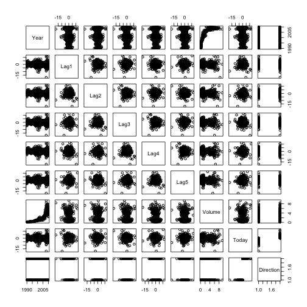

10
========================================================

### a


```r
library(ISLR)
summary(Weekly)
```

```
##       Year           Lag1              Lag2              Lag3        
##  Min.   :1990   Min.   :-18.195   Min.   :-18.195   Min.   :-18.195  
##  1st Qu.:1995   1st Qu.: -1.154   1st Qu.: -1.154   1st Qu.: -1.158  
##  Median :2000   Median :  0.241   Median :  0.241   Median :  0.241  
##  Mean   :2000   Mean   :  0.151   Mean   :  0.151   Mean   :  0.147  
##  3rd Qu.:2005   3rd Qu.:  1.405   3rd Qu.:  1.409   3rd Qu.:  1.409  
##  Max.   :2010   Max.   : 12.026   Max.   : 12.026   Max.   : 12.026  
##       Lag4              Lag5             Volume          Today        
##  Min.   :-18.195   Min.   :-18.195   Min.   :0.087   Min.   :-18.195  
##  1st Qu.: -1.158   1st Qu.: -1.166   1st Qu.:0.332   1st Qu.: -1.154  
##  Median :  0.238   Median :  0.234   Median :1.003   Median :  0.241  
##  Mean   :  0.146   Mean   :  0.140   Mean   :1.575   Mean   :  0.150  
##  3rd Qu.:  1.409   3rd Qu.:  1.405   3rd Qu.:2.054   3rd Qu.:  1.405  
##  Max.   : 12.026   Max.   : 12.026   Max.   :9.328   Max.   : 12.026  
##  Direction 
##  Down:484  
##  Up  :605  
##            
##            
##            
## 
```

```r
pairs(Weekly)
```

 

```r
cor(Weekly[, -9])
```

```
##            Year      Lag1     Lag2     Lag3      Lag4      Lag5   Volume
## Year    1.00000 -0.032289 -0.03339 -0.03001 -0.031128 -0.030519  0.84194
## Lag1   -0.03229  1.000000 -0.07485  0.05864 -0.071274 -0.008183 -0.06495
## Lag2   -0.03339 -0.074853  1.00000 -0.07572  0.058382 -0.072499 -0.08551
## Lag3   -0.03001  0.058636 -0.07572  1.00000 -0.075396  0.060657 -0.06929
## Lag4   -0.03113 -0.071274  0.05838 -0.07540  1.000000 -0.075675 -0.06107
## Lag5   -0.03052 -0.008183 -0.07250  0.06066 -0.075675  1.000000 -0.05852
## Volume  0.84194 -0.064951 -0.08551 -0.06929 -0.061075 -0.058517  1.00000
## Today  -0.03246 -0.075032  0.05917 -0.07124 -0.007826  0.011013 -0.03308
##            Today
## Year   -0.032460
## Lag1   -0.075032
## Lag2    0.059167
## Lag3   -0.071244
## Lag4   -0.007826
## Lag5    0.011013
## Volume -0.033078
## Today   1.000000
```


Year and Volume appear to have a relationship. No other patterns are
discernible.

### b


```r
attach(Weekly)
glm.fit = glm(Direction ~ Lag1 + Lag2 + Lag3 + Lag4 + Lag5 + Volume, data = Weekly, 
    family = binomial)
summary(glm.fit)
```

```
## 
## Call:
## glm(formula = Direction ~ Lag1 + Lag2 + Lag3 + Lag4 + Lag5 + 
##     Volume, family = binomial, data = Weekly)
## 
## Deviance Residuals: 
##    Min      1Q  Median      3Q     Max  
## -1.695  -1.256   0.991   1.085   1.458  
## 
## Coefficients:
##             Estimate Std. Error z value Pr(>|z|)   
## (Intercept)   0.2669     0.0859    3.11   0.0019 **
## Lag1         -0.0413     0.0264   -1.56   0.1181   
## Lag2          0.0584     0.0269    2.18   0.0296 * 
## Lag3         -0.0161     0.0267   -0.60   0.5469   
## Lag4         -0.0278     0.0265   -1.05   0.2937   
## Lag5         -0.0145     0.0264   -0.55   0.5833   
## Volume       -0.0227     0.0369   -0.62   0.5377   
## ---
## Signif. codes:  0 '***' 0.001 '**' 0.01 '*' 0.05 '.' 0.1 ' ' 1
## 
## (Dispersion parameter for binomial family taken to be 1)
## 
##     Null deviance: 1496.2  on 1088  degrees of freedom
## Residual deviance: 1486.4  on 1082  degrees of freedom
## AIC: 1500
## 
## Number of Fisher Scoring iterations: 4
```

Lag 2 appears to have some statistical significance with a Pr(>|z|) = 3%.

### c


```r
glm.probs = predict(glm.fit, type = "response")
glm.pred = rep("Down", length(glm.probs))
glm.pred[glm.probs > 0.5] = "Up"
table(glm.pred, Direction)
```

```
##         Direction
## glm.pred Down  Up
##     Down   54  48
##     Up    430 557
```

Percentage of currect predictions: (54+557)/(54+557+48+430) = 56.1%. Weeks the 
market goes up the logistic regression is right most of the time, 557/(557+48)
= 92.1%. Weeks the market goes up the logistic regression is wrong most of the
time 54/(430+54) = 11.2%.

### d

```r
train = (Year < 2009)
Weekly.0910 = Weekly[!train, ]
glm.fit = glm(Direction ~ Lag2, data = Weekly, family = binomial, subset = train)
glm.probs = predict(glm.fit, Weekly.0910, type = "response")
glm.pred = rep("Down", length(glm.probs))
glm.pred[glm.probs > 0.5] = "Up"
Direction.0910 = Direction[!train]
table(glm.pred, Direction.0910)
```

```
##         Direction.0910
## glm.pred Down Up
##     Down    9  5
##     Up     34 56
```

```r
mean(glm.pred == Direction.0910)
```

```
## [1] 0.625
```


### e

```r
library(MASS)
lda.fit = lda(Direction ~ Lag2, data = Weekly, subset = train)
lda.pred = predict(lda.fit, Weekly.0910)
table(lda.pred$class, Direction.0910)
```

```
##       Direction.0910
##        Down Up
##   Down    9  5
##   Up     34 56
```

```r
mean(lda.pred$class == Direction.0910)
```

```
## [1] 0.625
```


## f

```r
qda.fit = qda(Direction ~ Lag2, data = Weekly, subset = train)
qda.class = predict(qda.fit, Weekly.0910)$class
table(qda.class, Direction.0910)
```

```
##          Direction.0910
## qda.class Down Up
##      Down    0  0
##      Up     43 61
```

```r
mean(qda.class == Direction.0910)
```

```
## [1] 0.5865
```

A correctness of 58.7% even though it picked Up the whole time!

### g

```r
library(class)
train.X = as.matrix(Lag2[train])
test.X = as.matrix(Lag2[!train])
train.Direction = Direction[train]
set.seed(1)
knn.pred = knn(train.X, test.X, train.Direction, k = 1)
table(knn.pred, Direction.0910)
```

```
##         Direction.0910
## knn.pred Down Up
##     Down   21 30
##     Up     22 31
```

```r
mean(knn.pred == Direction.0910)
```

```
## [1] 0.5
```


### h
Logistic regression and LDA methods provide similar test error rates.

### i

```r
# Logistic regression with Lag2:Lag1
glm.fit = glm(Direction ~ Lag2:Lag1, data = Weekly, family = binomial, subset = train)
glm.probs = predict(glm.fit, Weekly.0910, type = "response")
glm.pred = rep("Down", length(glm.probs))
glm.pred[glm.probs > 0.5] = "Up"
Direction.0910 = Direction[!train]
table(glm.pred, Direction.0910)
```

```
##         Direction.0910
## glm.pred Down Up
##     Down    1  1
##     Up     42 60
```

```r
mean(glm.pred == Direction.0910)
```

```
## [1] 0.5865
```

```r

# LDA with Lag2 interaction with Lag1
lda.fit = lda(Direction ~ Lag2:Lag1, data = Weekly, subset = train)
lda.pred = predict(lda.fit, Weekly.0910)
mean(lda.pred$class == Direction.0910)
```

```
## [1] 0.5769
```

```r

# QDA with sqrt(abs(Lag2))
qda.fit = qda(Direction ~ Lag2 + sqrt(abs(Lag2)), data = Weekly, subset = train)
qda.class = predict(qda.fit, Weekly.0910)$class
table(qda.class, Direction.0910)
```

```
##          Direction.0910
## qda.class Down Up
##      Down   12 13
##      Up     31 48
```

```r
mean(qda.class == Direction.0910)
```

```
## [1] 0.5769
```

```r

# KNN k =10
knn.pred = knn(train.X, test.X, train.Direction, k = 10)
table(knn.pred, Direction.0910)
```

```
##         Direction.0910
## knn.pred Down Up
##     Down   17 18
##     Up     26 43
```

```r
mean(knn.pred == Direction.0910)
```

```
## [1] 0.5769
```

```r

# KNN k = 100
knn.pred = knn(train.X, test.X, train.Direction, k = 100)
table(knn.pred, Direction.0910)
```

```
##         Direction.0910
## knn.pred Down Up
##     Down    9 12
##     Up     34 49
```

```r
mean(knn.pred == Direction.0910)
```

```
## [1] 0.5577
```

Out of these permutations, the original LDA and logistic regression have better
performance in terms of test error rate.


