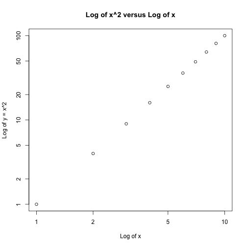
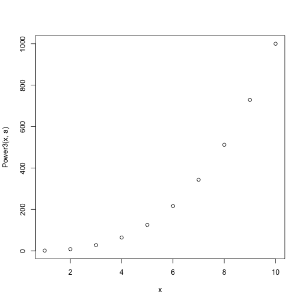

12
========================================================

### a

```r
Power = function() {
    2^3
}
print(Power())
```

```
## [1] 8
```


### b

```r
Power2 = function(x, a) {
    x^a
}
Power2(3, 8)
```

```
## [1] 6561
```


### c

```r
Power2(10, 3)
```

```
## [1] 1000
```

```r
Power2(8, 17)
```

```
## [1] 2.252e+15
```

```r
Power2(131, 3)
```

```
## [1] 2248091
```


### d

```r
Power3 = function(x, a) {
    result = x^a
    return(result)
}
```


### e

```r
x = 1:10
plot(x, Power3(x, 2), log = "xy", ylab = "Log of y = x^2", xlab = "Log of x", 
    main = "Log of x^2 versus Log of x")
```

 


### f

```r
PlotPower = function(x, a) {
    plot(x, Power3(x, a))
}
PlotPower(1:10, 3)
```

 

