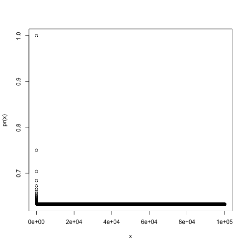

Chapter 5: Exercise 2
========================================================

### a
$1 - 1/n$

### b
$1 - 1/n$

### c
In bootstrap, we sample with replacement so each observation in the bootstrap
sample has the same 1/n (independent) chance of equaling the jth observation. 
Applying the product rule for a total of n observations gives us $(1 - 1/n)^n$.

### d
$Pr(in) = 1 - Pr(out) = 1 - (1 - 1/5)^5 = 1 - (4/5)^5 = 67.2\%$

### e
$Pr(in) = 1 - Pr(out) = 1 - (1 - 1/100)^{10} = 1 - (99/100)^{100} = 63.4\%$

### f
$1 - (1 - 1/10000)^{10000} = 63.2\%$

### g

```r
pr = function(n) return(1 - (1 - 1/n)^n)
x = 1:1e+05
plot(x, pr(x))
```

 

The plot quickly reaches an asymptote of about 63.2%.

### h


