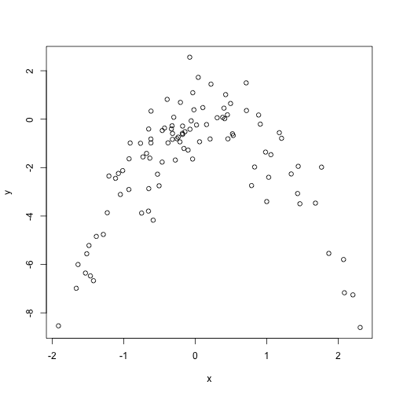

Chapter 5: Exercise 8
========================================================

### a

```r
set.seed(1)
y = rnorm(100)
x = rnorm(100)
y = x - 2 * x^2 + rnorm(100)
```


n = 100, p = 2.

$Y = X - 2 X^2 + \epsilon$.

### b

```r
plot(x, y)
```

 

Quadratic plot. $X$ from about -2 to 2. $Y$ from about -8 to 2.

### c

```r
library(boot)
Data = data.frame(x, y)
set.seed(1)
# i.
glm.fit = glm(y ~ x)
cv.glm(Data, glm.fit)$delta
```

```
## [1] 5.891 5.889
```

```r
# ii.
glm.fit = glm(y ~ poly(x, 2))
cv.glm(Data, glm.fit)$delta
```

```
## [1] 1.087 1.086
```

```r
# iii.
glm.fit = glm(y ~ poly(x, 3))
cv.glm(Data, glm.fit)$delta
```

```
## [1] 1.103 1.102
```

```r
# iv.
glm.fit = glm(y ~ poly(x, 4))
cv.glm(Data, glm.fit)$delta
```

```
## [1] 1.115 1.114
```


### d

```r
set.seed(10)
# i.
glm.fit = glm(y ~ x)
cv.glm(Data, glm.fit)$delta
```

```
## [1] 5.891 5.889
```

```r
# ii.
glm.fit = glm(y ~ poly(x, 2))
cv.glm(Data, glm.fit)$delta
```

```
## [1] 1.087 1.086
```

```r
# iii.
glm.fit = glm(y ~ poly(x, 3))
cv.glm(Data, glm.fit)$delta
```

```
## [1] 1.103 1.102
```

```r
# iv.
glm.fit = glm(y ~ poly(x, 4))
cv.glm(Data, glm.fit)$delta
```

```
## [1] 1.115 1.114
```

Exact same, because LOOCV will be the same since it evaluates n folds of a
single observation.

### e
The quadratic polynomial had the lowest LOOCV test error rate. This was
expected because it matches the true form of $Y$.

### f

```r
summary(glm.fit)
```

```
## 
## Call:
## glm(formula = y ~ poly(x, 4))
## 
## Deviance Residuals: 
##     Min       1Q   Median       3Q      Max  
## -2.8913  -0.5244   0.0749   0.5932   2.7796  
## 
## Coefficients:
##             Estimate Std. Error t value Pr(>|t|)    
## (Intercept)   -1.828      0.104  -17.55   <2e-16 ***
## poly(x, 4)1    2.316      1.041    2.22    0.029 *  
## poly(x, 4)2  -21.059      1.041  -20.22   <2e-16 ***
## poly(x, 4)3   -0.305      1.041   -0.29    0.770    
## poly(x, 4)4   -0.493      1.041   -0.47    0.637    
## ---
## Signif. codes:  0 '***' 0.001 '**' 0.01 '*' 0.05 '.' 0.1 ' ' 1
## 
## (Dispersion parameter for gaussian family taken to be 1.085)
## 
##     Null deviance: 552.21  on 99  degrees of freedom
## Residual deviance: 103.04  on 95  degrees of freedom
## AIC: 298.8
## 
## Number of Fisher Scoring iterations: 2
```

p-values show statistical significance of linear and quadratic terms, which
agrees with the CV results.


