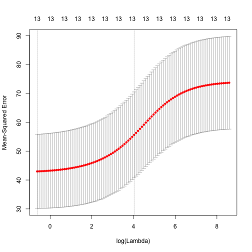

Chapter 6: Exercise 11
======================

## a

```r
set.seed(1)
library(MASS)
library(leaps)
library(glmnet)
```

```
## Loading required package: Matrix Loading required package: lattice Loaded
## glmnet 1.9-5
```


### Best subset selection

```r
predict.regsubsets = function(object, newdata, id, ...) {
    form = as.formula(object$call[[2]])
    mat = model.matrix(form, newdata)
    coefi = coef(object, id = id)
    mat[, names(coefi)] %*% coefi
}

k = 10
p = ncol(Boston) - 1
folds = sample(rep(1:k, length = nrow(Boston)))
cv.errors = matrix(NA, k, p)
for (i in 1:k) {
    best.fit = regsubsets(crim ~ ., data = Boston[folds != i, ], nvmax = p)
    for (j in 1:p) {
        pred = predict(best.fit, Boston[folds == i, ], id = j)
        cv.errors[i, j] = mean((Boston$crim[folds == i] - pred)^2)
    }
}
rmse.cv = sqrt(apply(cv.errors, 2, mean))
plot(rmse.cv, pch = 19, type = "b")
```

 

```r
which.min(rmse.cv)
```

```
## [1] 9
```

```r
rmse.cv[which.min(rmse.cv)]
```

```
## [1] 6.593
```


### Lasso

```r
x = model.matrix(crim ~ . - 1, data = Boston)
y = Boston$crim
cv.lasso = cv.glmnet(x, y, type.measure = "mse")
plot(cv.lasso)
```

 

```r
coef(cv.lasso)
```

```
## 14 x 1 sparse Matrix of class "dgCMatrix"
##                  1
## (Intercept) 1.0894
## zn          .     
## indus       .     
## chas        .     
## nox         .     
## rm          .     
## age         .     
## dis         .     
## rad         0.2643
## tax         .     
## ptratio     .     
## black       .     
## lstat       .     
## medv        .
```

```r
sqrt(cv.lasso$cvm[cv.lasso$lambda == cv.lasso$lambda.1se])
```

```
## [1] 7.405
```


### Ridge regression

```r
x = model.matrix(crim ~ . - 1, data = Boston)
y = Boston$crim
cv.ridge = cv.glmnet(x, y, type.measure = "mse", alpha = 0)
plot(cv.ridge)
```

 

```r
coef(cv.ridge)
```

```
## 14 x 1 sparse Matrix of class "dgCMatrix"
##                     1
## (Intercept)  1.017517
## zn          -0.002806
## indus        0.034406
## chas        -0.225251
## nox          2.249887
## rm          -0.162546
## age          0.007343
## dis         -0.114929
## rad          0.059814
## tax          0.002659
## ptratio      0.086423
## black       -0.003342
## lstat        0.044495
## medv        -0.029125
```

```r
sqrt(cv.ridge$cvm[cv.ridge$lambda == cv.ridge$lambda.1se])
```

```
## [1] 7.457
```


### PCR

```r
library(pls)
```

```
## Attaching package: 'pls'
## 
## The following object is masked from 'package:stats':
## 
## loadings
```

```r
pcr.fit = pcr(crim ~ ., data = Boston, scale = TRUE, validation = "CV")
summary(pcr.fit)
```

```
## Data: 	X dimension: 506 13 
## 	Y dimension: 506 1
## Fit method: svdpc
## Number of components considered: 13
## 
## VALIDATION: RMSEP
## Cross-validated using 10 random segments.
##        (Intercept)  1 comps  2 comps  3 comps  4 comps  5 comps  6 comps
## CV            8.61    7.170    7.163    6.733    6.728    6.740    6.765
## adjCV         8.61    7.169    7.162    6.730    6.723    6.737    6.760
##        7 comps  8 comps  9 comps  10 comps  11 comps  12 comps  13 comps
## CV       6.760    6.634    6.652     6.642     6.652     6.607     6.546
## adjCV    6.754    6.628    6.644     6.635     6.643     6.598     6.536
## 
## TRAINING: % variance explained
##       1 comps  2 comps  3 comps  4 comps  5 comps  6 comps  7 comps
## X       47.70    60.36    69.67    76.45    82.99    88.00    91.14
## crim    30.69    30.87    39.27    39.61    39.61    39.86    40.14
##       8 comps  9 comps  10 comps  11 comps  12 comps  13 comps
## X       93.45    95.40     97.04     98.46     99.52     100.0
## crim    42.47    42.55     42.78     43.04     44.13      45.4
```

13 component pcr fit has lowest CV/adjCV RMSEP.

## b
See above answers for cross-validate mean squared errors of selected models. 

## c
I would choose the 9 parameter best subset model because it had the best 
cross-validated RMSE, next to PCR, but it was simpler model than the 13
component PCR model.
