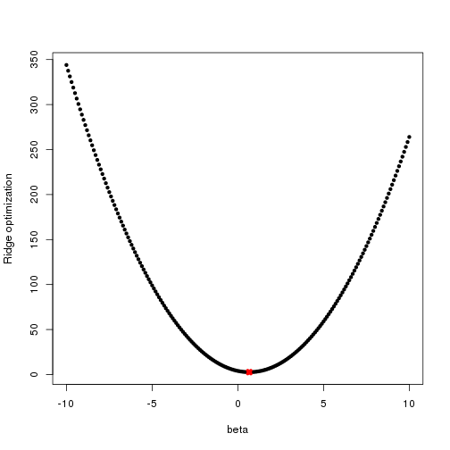
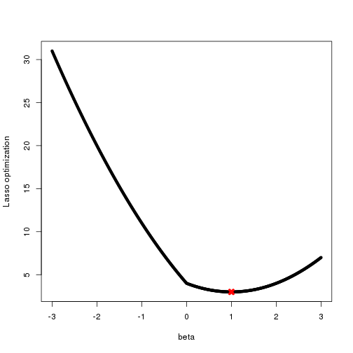

Chapter 6: Exercise 6
========================================================

### a
For $p=1$, (6.12) takes the form $(y - \beta)^2 + \lambda\beta^2$. We plot this function for $y = 2, \lambda = 2$.

```r
y = 2
lambda = 2
betas = seq(-10, 10, 0.1)
func = (y - betas)^2 + lambda * betas^2
plot(betas, func, pch = 20, xlab = "beta", ylab = "Ridge optimization")
est.beta = y/(1 + lambda)
est.func = (y - est.beta)^2 + lambda * est.beta^2
points(est.beta, est.func, col = "red", pch = 4, lwd = 5, cex = est.beta)
```

 

The red cross shows that function is indeed minimized at $\beta = y / (1 + \lambda)$.

### b
For $p=1$, (6.13) takes the form $(y - \beta)^2 + \lambda | \beta |$. We plot this function for $y = 2, \lambda = 2$.

```r
y = 2
lambda = 2
betas = seq(-3, 3, 0.01)
func = (y - betas)^2 + lambda * abs(betas)
plot(betas, func, pch = 20, xlab = "beta", ylab = "Lasso optimization")
est.beta = y - lambda/2
est.func = (y - est.beta)^2 + lambda * abs(est.beta)
points(est.beta, est.func, col = "red", pch = 4, lwd = 5, cex = est.beta)
```

 

The red cross shows that function is indeed minimized at $\beta = y - \lambda / 2$.
