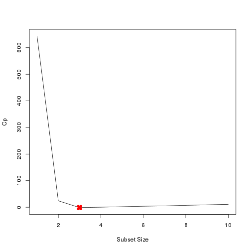
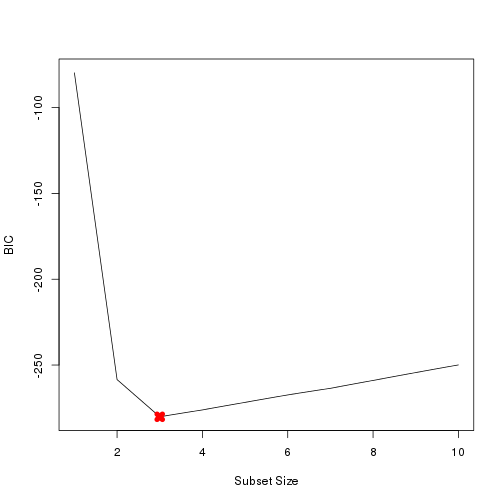
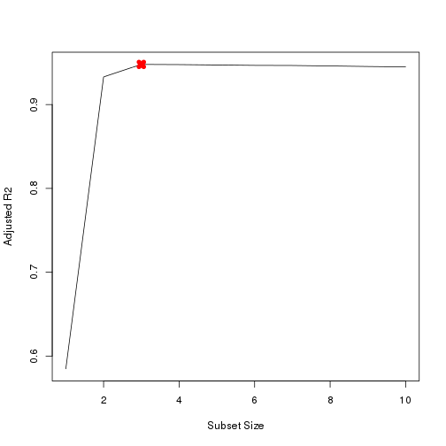
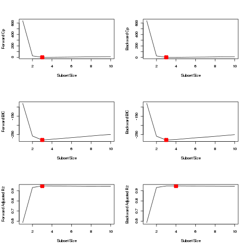
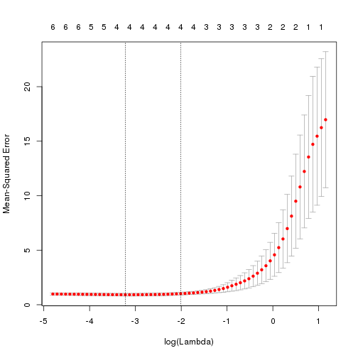

Chater 6: Exercise 8
========================================================

### a
Create 100 $X$ and $\epsilon$ variables

```r
set.seed(1)
X = rnorm(100)
eps = rnorm(100)
```


### b
We are selecting $\beta_0 = 3$, $\beta_1 = 2$, $\beta_2 = -3$ and $\beta_3 = 0.3$.

```r
beta0 = 3
beta1 = 2
beta2 = -3
beta3 = 0.3
Y = beta0 + beta1 * X + beta2 * X^2 + beta3 * X^3 + eps
```


### c
Use $regsubsets$ to select best model having polynomial of $X$ of degree 10

```r
library(leaps)
data.full = data.frame(y = Y, x = X)
mod.full = regsubsets(y ~ poly(x, 10, raw = T), data = data.full, nvmax = 10)
mod.summary = summary(mod.full)

# Find the model size for best cp, BIC and adjr2
which.min(mod.summary$cp)
```

```
## [1] 3
```

```r
which.min(mod.summary$bic)
```

```
## [1] 3
```

```r
which.max(mod.summary$adjr2)
```

```
## [1] 3
```

```r
# Plot cp, BIC and adjr2
plot(mod.summary$cp, xlab = "Subset Size", ylab = "Cp", pch = 20, type = "l")
points(3, mod.summary$cp[3], pch = 4, col = "red", lwd = 7)
```

 

```r
plot(mod.summary$bic, xlab = "Subset Size", ylab = "BIC", pch = 20, type = "l")
points(3, mod.summary$bic[3], pch = 4, col = "red", lwd = 7)
```

 

```r
plot(mod.summary$adjr2, xlab = "Subset Size", ylab = "Adjusted R2", pch = 20, 
    type = "l")
points(3, mod.summary$adjr2[3], pch = 4, col = "red", lwd = 7)
```

 

We find that with Cp, BIC and Adjusted R2 criteria, $3$, $3$, and $3$ variable models are respectively picked. 

```r
coefficients(mod.full, id = 3)
```

```
##           (Intercept) poly(x, 10, raw = T)1 poly(x, 10, raw = T)2 
##               3.07627               2.35624              -3.16515 
## poly(x, 10, raw = T)7 
##               0.01047
```

All statistics pick $X^7$ over $X^3$. The remaining coefficients are quite close to $\beta$ s.

### d
We fit forward and backward stepwise models to the data.

```r
mod.fwd = regsubsets(y ~ poly(x, 10, raw = T), data = data.full, nvmax = 10, 
    method = "forward")
mod.bwd = regsubsets(y ~ poly(x, 10, raw = T), data = data.full, nvmax = 10, 
    method = "backward")
fwd.summary = summary(mod.fwd)
bwd.summary = summary(mod.bwd)
which.min(fwd.summary$cp)
```

```
## [1] 3
```

```r
which.min(bwd.summary$cp)
```

```
## [1] 3
```

```r
which.min(fwd.summary$bic)
```

```
## [1] 3
```

```r
which.min(bwd.summary$bic)
```

```
## [1] 3
```

```r
which.max(fwd.summary$adjr2)
```

```
## [1] 3
```

```r
which.max(bwd.summary$adjr2)
```

```
## [1] 4
```

```r
# Plot the statistics
par(mfrow = c(3, 2))
plot(fwd.summary$cp, xlab = "Subset Size", ylab = "Forward Cp", pch = 20, type = "l")
points(3, fwd.summary$cp[3], pch = 4, col = "red", lwd = 7)
plot(bwd.summary$cp, xlab = "Subset Size", ylab = "Backward Cp", pch = 20, type = "l")
points(3, bwd.summary$cp[3], pch = 4, col = "red", lwd = 7)
plot(fwd.summary$bic, xlab = "Subset Size", ylab = "Forward BIC", pch = 20, 
    type = "l")
points(3, fwd.summary$bic[3], pch = 4, col = "red", lwd = 7)
plot(bwd.summary$bic, xlab = "Subset Size", ylab = "Backward BIC", pch = 20, 
    type = "l")
points(3, bwd.summary$bic[3], pch = 4, col = "red", lwd = 7)
plot(fwd.summary$adjr2, xlab = "Subset Size", ylab = "Forward Adjusted R2", 
    pch = 20, type = "l")
points(3, fwd.summary$adjr2[3], pch = 4, col = "red", lwd = 7)
plot(bwd.summary$adjr2, xlab = "Subset Size", ylab = "Backward Adjusted R2", 
    pch = 20, type = "l")
points(4, bwd.summary$adjr2[4], pch = 4, col = "red", lwd = 7)
```

 

We see that all statistics pick $3$ variable models except backward stepwise with adjusted R2. Here are the coefficients

```r
coefficients(mod.fwd, id = 3)
```

```
##           (Intercept) poly(x, 10, raw = T)1 poly(x, 10, raw = T)2 
##               3.07627               2.35624              -3.16515 
## poly(x, 10, raw = T)7 
##               0.01047
```

```r
coefficients(mod.bwd, id = 3)
```

```
##           (Intercept) poly(x, 10, raw = T)1 poly(x, 10, raw = T)2 
##               3.07888               2.41982              -3.17724 
## poly(x, 10, raw = T)9 
##               0.00187
```

```r
coefficients(mod.fwd, id = 4)
```

```
##           (Intercept) poly(x, 10, raw = T)1 poly(x, 10, raw = T)2 
##              3.112359              2.369859             -3.275727 
## poly(x, 10, raw = T)4 poly(x, 10, raw = T)7 
##              0.027674              0.009997
```

Here forward stepwise picks $X^7$ over $X^3$. Backward stepwise with $3$ variables picks $X^9$ while backward stepwise with $4$ variables picks $X^4$ and $X^7$. All other coefficients are close to $\beta$ s.

### e
Training Lasso on the data

```r
library(glmnet)
```

```
## Loading required package: Matrix
## Loading required package: lattice
## Loaded glmnet 1.9-5
```

```r
xmat = model.matrix(y ~ poly(x, 10, raw = T), data = data.full)[, -1]
mod.lasso = cv.glmnet(xmat, Y, alpha = 1)
best.lambda = mod.lasso$lambda.min
best.lambda
```

```
## [1] 0.03991
```

```r
plot(mod.lasso)
```

 

```r
# Next fit the model on entire data using best lambda
best.model = glmnet(xmat, Y, alpha = 1)
predict(best.model, s = best.lambda, type = "coefficients")
```

```
## 11 x 1 sparse Matrix of class "dgCMatrix"
##                                 1
## (Intercept)             3.0398151
## poly(x, 10, raw = T)1   2.2303371
## poly(x, 10, raw = T)2  -3.1033193
## poly(x, 10, raw = T)3   .        
## poly(x, 10, raw = T)4   .        
## poly(x, 10, raw = T)5   0.0498411
## poly(x, 10, raw = T)6   .        
## poly(x, 10, raw = T)7   0.0008068
## poly(x, 10, raw = T)8   .        
## poly(x, 10, raw = T)9   .        
## poly(x, 10, raw = T)10  .
```

Lasso also picks $X^5$ over $X^3$. It also picks $X^7$ with negligible coefficient.

### f
Create new Y with different $\beta_7 = 7$.

```r
beta7 = 7
Y = beta0 + beta7 * X^7 + eps
# Predict using regsubsets
data.full = data.frame(y = Y, x = X)
mod.full = regsubsets(y ~ poly(x, 10, raw = T), data = data.full, nvmax = 10)
mod.summary = summary(mod.full)

# Find the model size for best cp, BIC and adjr2
which.min(mod.summary$cp)
```

```
## [1] 2
```

```r
which.min(mod.summary$bic)
```

```
## [1] 1
```

```r
which.max(mod.summary$adjr2)
```

```
## [1] 4
```

```r
coefficients(mod.full, id = 1)
```

```
##           (Intercept) poly(x, 10, raw = T)7 
##                 2.959                 7.001
```

```r
coefficients(mod.full, id = 2)
```

```
##           (Intercept) poly(x, 10, raw = T)2 poly(x, 10, raw = T)7 
##                3.0705               -0.1417                7.0016
```

```r
coefficients(mod.full, id = 4)
```

```
##           (Intercept) poly(x, 10, raw = T)1 poly(x, 10, raw = T)2 
##                3.0763                0.2914               -0.1618 
## poly(x, 10, raw = T)3 poly(x, 10, raw = T)7 
##               -0.2527                7.0091
```

We see that BIC picks the most accurate 1-variable model with matching coefficients. Other criteria pick additional variables.

```r
xmat = model.matrix(y ~ poly(x, 10, raw = T), data = data.full)[, -1]
mod.lasso = cv.glmnet(xmat, Y, alpha = 1)
best.lambda = mod.lasso$lambda.min
best.lambda
```

```
## [1] 12.37
```

```r
best.model = glmnet(xmat, Y, alpha = 1)
predict(best.model, s = best.lambda, type = "coefficients")
```

```
## 11 x 1 sparse Matrix of class "dgCMatrix"
##                            1
## (Intercept)            3.820
## poly(x, 10, raw = T)1  .    
## poly(x, 10, raw = T)2  .    
## poly(x, 10, raw = T)3  .    
## poly(x, 10, raw = T)4  .    
## poly(x, 10, raw = T)5  .    
## poly(x, 10, raw = T)6  .    
## poly(x, 10, raw = T)7  6.797
## poly(x, 10, raw = T)8  .    
## poly(x, 10, raw = T)9  .    
## poly(x, 10, raw = T)10 .
```

Lasso also picks the best 1-variable model but intercet is quite off ($3.8$ vs $3$).
