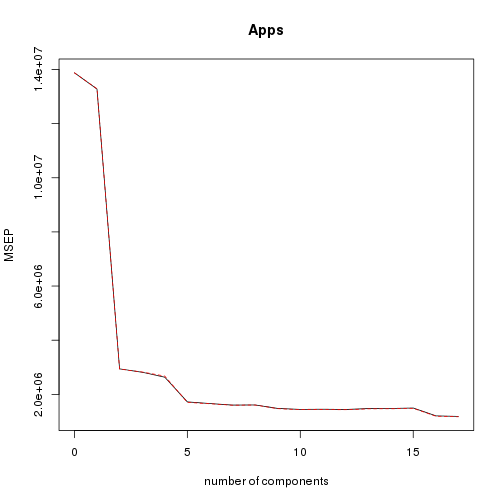
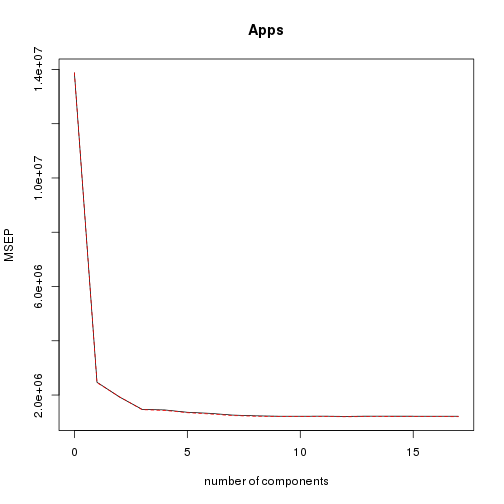

Chapter 6: Exercise 9
========================================================

### a
Load and split the College data

```r
library(ISLR)
set.seed(11)
sum(is.na(College))
```

```
## [1] 0
```

```r
train.size = dim(College)[1]/2
train = sample(1:dim(College)[1], train.size)
test = -train
College.train = College[train, ]
College.test = College[test, ]
```


### b
NUmber of applications is the Apps variable.

```r
lm.fit = lm(Apps ~ ., data = College.train)
lm.pred = predict(lm.fit, College.test)
mean((College.test[, "Apps"] - lm.pred)^2)
```

```
## [1] 1538442
```

Test RSS is $1538442$

### c
Pick $\lambda$ using College.train and report error on College.test

```r
library(glmnet)
```

```
## Loading required package: Matrix
## Loading required package: lattice
## Loaded glmnet 1.9-5
```

```r
train.mat = model.matrix(Apps ~ ., data = College.train)
test.mat = model.matrix(Apps ~ ., data = College.test)
grid = 10^seq(4, -2, length = 100)
mod.ridge = cv.glmnet(train.mat, College.train[, "Apps"], alpha = 0, lambda = grid, 
    thresh = 1e-12)
lambda.best = mod.ridge$lambda.min
lambda.best
```

```
## [1] 18.74
```

```r
ridge.pred = predict(mod.ridge, newx = test.mat, s = lambda.best)
mean((College.test[, "Apps"] - ridge.pred)^2)
```

```
## [1] 1608859
```

Test RSS is slightly higher that OLS, $1608859$.

### d
Pick $\lambda$ using College.train and report error on College.test

```r
mod.lasso = cv.glmnet(train.mat, College.train[, "Apps"], alpha = 1, lambda = grid, 
    thresh = 1e-12)
lambda.best = mod.lasso$lambda.min
lambda.best
```

```
## [1] 21.54
```

```r
lasso.pred = predict(mod.lasso, newx = test.mat, s = lambda.best)
mean((College.test[, "Apps"] - lasso.pred)^2)
```

```
## [1] 1635280
```

Again, Test RSS is slightly higher that OLS, $1635280$.

The coefficients look like

```r
mod.lasso = glmnet(model.matrix(Apps ~ ., data = College), College[, "Apps"], 
    alpha = 1)
predict(mod.lasso, s = lambda.best, type = "coefficients")
```

```
## 19 x 1 sparse Matrix of class "dgCMatrix"
##                      1
## (Intercept) -6.038e+02
## (Intercept)  .        
## PrivateYes  -4.235e+02
## Accept       1.455e+00
## Enroll      -2.004e-01
## Top10perc    3.368e+01
## Top25perc   -2.403e+00
## F.Undergrad  .        
## P.Undergrad  2.086e-02
## Outstate    -5.782e-02
## Room.Board   1.246e-01
## Books        .        
## Personal     1.833e-05
## PhD         -5.601e+00
## Terminal    -3.314e+00
## S.F.Ratio    4.479e+00
## perc.alumni -9.797e-01
## Expend       6.968e-02
## Grad.Rate    5.160e+00
```


### e
Use validation to fit pcr

```r
library(pls)
```

```
## 
## Attaching package: 'pls'
## 
## The following object(s) are masked from 'package:stats':
## 
##     loadings
```

```r
pcr.fit = pcr(Apps ~ ., data = College.train, scale = T, validation = "CV")
validationplot(pcr.fit, val.type = "MSEP")
```

 

```r
pcr.pred = predict(pcr.fit, College.train, ncomp = 15)
mean((College.test[, "Apps"] - data.frame(pcr.pred))^2)
```

```
## [1] 27073674
```


### f
Use validation to fit pls

```r
pls.fit = plsr(Apps ~ ., data = College.train, scale = T, validation = "CV")
validationplot(pls.fit, val.type = "MSEP")
```

 

```r
pls.pred = predict(pls.fit, College.train, ncomp = 10)
mean((College.test[, "Apps"] - data.frame(pcr.pred))^2)
```

```
## [1] 27073674
```

