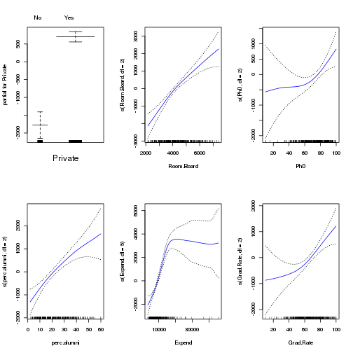

Chapter 7: Exercise 10
========================================================

### a

```r
set.seed(1)
library(ISLR)
library(leaps)
attach(College)
train = sample(length(Outstate), length(Outstate)/2)
test = -train
College.train = College[train, ]
College.test = College[test, ]
reg.fit = regsubsets(Outstate ~ ., data = College.train, nvmax = 17, method = "forward")
reg.summary = summary(reg.fit)
par(mfrow = c(1, 3))
plot(reg.summary$cp, xlab = "Number of Variables", ylab = "Cp", type = "l")
min.cp = min(reg.summary$cp)
std.cp = sd(reg.summary$cp)
abline(h = min.cp + 0.2 * std.cp, col = "red", lty = 2)
abline(h = min.cp - 0.2 * std.cp, col = "red", lty = 2)
plot(reg.summary$bic, xlab = "Number of Variables", ylab = "BIC", type = "l")
min.bic = min(reg.summary$bic)
std.bic = sd(reg.summary$bic)
abline(h = min.bic + 0.2 * std.bic, col = "red", lty = 2)
abline(h = min.bic - 0.2 * std.bic, col = "red", lty = 2)
plot(reg.summary$adjr2, xlab = "Number of Variables", ylab = "Adjusted R2", 
    type = "l", ylim = c(0.4, 0.84))
max.adjr2 = max(reg.summary$adjr2)
std.adjr2 = sd(reg.summary$adjr2)
abline(h = max.adjr2 + 0.2 * std.adjr2, col = "red", lty = 2)
abline(h = max.adjr2 - 0.2 * std.adjr2, col = "red", lty = 2)
```

 

All cp, BIC and adjr2 scores show that size 6 is the minimum size for the subset for which the scores are withing 0.2 standard deviations of optimum. We pick 6 as the best subset size and find best 6 variables using entire data.

```r
reg.fit = regsubsets(Outstate ~ ., data = College, method = "forward")
coefi = coef(reg.fit, id = 6)
names(coefi)
```

```
## [1] "(Intercept)" "PrivateYes"  "Room.Board"  "PhD"         "perc.alumni"
## [6] "Expend"      "Grad.Rate"
```


### b

```r
library(gam)
```

```
## Loading required package: splines
## Loaded gam 1.09
```

```r
gam.fit = gam(Outstate ~ Private + s(Room.Board, df = 2) + s(PhD, df = 2) + 
    s(perc.alumni, df = 2) + s(Expend, df = 5) + s(Grad.Rate, df = 2), data = College.train)
par(mfrow = c(2, 3))
plot(gam.fit, se = T, col = "blue")
```

 


### c

```r
gam.pred = predict(gam.fit, College.test)
gam.err = mean((College.test$Outstate - gam.pred)^2)
gam.err
```

```
## [1] 3745460
```

```r
gam.tss = mean((College.test$Outstate - mean(College.test$Outstate))^2)
test.rss = 1 - gam.err/gam.tss
test.rss
```

```
## [1] 0.7697
```

We obtain a test R-squared of 0.77 using GAM with 6 predictors. This is a slight improvement over a test RSS of 0.74 obtained using OLS. 

### d

```r
summary(gam.fit)
```

```
## 
## Call: gam(formula = Outstate ~ Private + s(Room.Board, df = 2) + s(PhD, 
##     df = 2) + s(perc.alumni, df = 2) + s(Expend, df = 5) + s(Grad.Rate, 
##     df = 2), data = College.train)
## Deviance Residuals:
##     Min      1Q  Median      3Q     Max 
## -4977.7 -1184.5    58.3  1220.0  7688.3 
## 
## (Dispersion Parameter for gaussian family taken to be 3300711)
## 
##     Null Deviance: 6.222e+09 on 387 degrees of freedom
## Residual Deviance: 1.231e+09 on 373 degrees of freedom
## AIC: 6942 
## 
## Number of Local Scoring Iterations: 2 
## 
## Anova for Parametric Effects
##                         Df   Sum Sq  Mean Sq F value  Pr(>F)    
## Private                  1 1.78e+09 1.78e+09   539.1 < 2e-16 ***
## s(Room.Board, df = 2)    1 1.22e+09 1.22e+09   370.2 < 2e-16 ***
## s(PhD, df = 2)           1 3.82e+08 3.82e+08   115.9 < 2e-16 ***
## s(perc.alumni, df = 2)   1 3.28e+08 3.28e+08    99.5 < 2e-16 ***
## s(Expend, df = 5)        1 4.17e+08 4.17e+08   126.2 < 2e-16 ***
## s(Grad.Rate, df = 2)     1 5.53e+07 5.53e+07    16.8 5.2e-05 ***
## Residuals              373 1.23e+09 3.30e+06                    
## ---
## Signif. codes:  0 '***' 0.001 '**' 0.01 '*' 0.05 '.' 0.1 ' ' 1 
## 
## Anova for Nonparametric Effects
##                        Npar Df Npar F Pr(F)    
## (Intercept)                                    
## Private                                        
## s(Room.Board, df = 2)        1   3.56 0.060 .  
## s(PhD, df = 2)               1   4.34 0.038 *  
## s(perc.alumni, df = 2)       1   1.92 0.167    
## s(Expend, df = 5)            4  16.86 1e-12 ***
## s(Grad.Rate, df = 2)         1   3.72 0.055 .  
## ---
## Signif. codes:  0 '***' 0.001 '**' 0.01 '*' 0.05 '.' 0.1 ' ' 1
```

Non-parametric Anova test shows a strong evidence of non-linear relationship between response and Expend, and a moderately strong non-linear relationship (using p value of 0.05) between response and Grad.Rate or PhD. 
