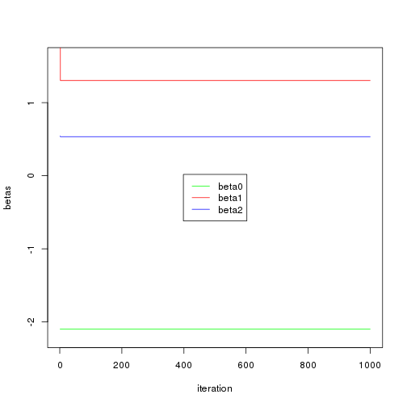
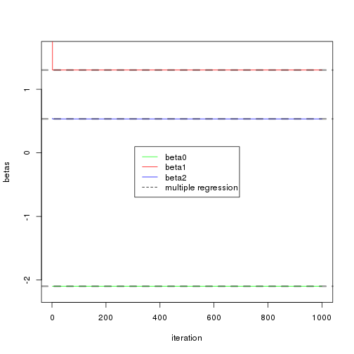

Chapter 7: Exercise 11
========================================================

### a
We create variables according to the equation $Y = -2.1 + 1.3X_1 + 0.54X_2$.

```r
set.seed(1)
X1 = rnorm(100)
X2 = rnorm(100)
eps = rnorm(100, sd = 0.1)
Y = -2.1 + 1.3 * X1 + 0.54 * X2 + eps
```


### b
Create a list of 1000 $\hat{beta}_0$, $\hat{beta}_1$ and $\hat{beta}_2$. Initialize first of the $\hat{\beta}_1$ to 10.


```r
beta0 = rep(NA, 1000)
beta1 = rep(NA, 1000)
beta2 = rep(NA, 1000)
beta1[1] = 10
```


### c, d, e
Accumulate results of 1000 iterations in the beta arrays.

```r
for (i in 1:1000) {
    a = Y - beta1[i] * X1
    beta2[i] = lm(a ~ X2)$coef[2]
    a = Y - beta2[i] * X2
    lm.fit = lm(a ~ X1)
    if (i < 1000) {
        beta1[i + 1] = lm.fit$coef[2]
    }
    beta0[i] = lm.fit$coef[1]
}
plot(1:1000, beta0, type = "l", xlab = "iteration", ylab = "betas", ylim = c(-2.2, 
    1.6), col = "green")
lines(1:1000, beta1, col = "red")
lines(1:1000, beta2, col = "blue")
legend("center", c("beta0", "beta1", "beta2"), lty = 1, col = c("green", "red", 
    "blue"))
```

 

The coefficients quickly attain their least square values.

### f

```r
lm.fit = lm(Y ~ X1 + X2)
plot(1:1000, beta0, type = "l", xlab = "iteration", ylab = "betas", ylim = c(-2.2, 
    1.6), col = "green")
lines(1:1000, beta1, col = "red")
lines(1:1000, beta2, col = "blue")
abline(h = lm.fit$coef[1], lty = "dashed", lwd = 3, col = rgb(0, 0, 0, alpha = 0.4))
abline(h = lm.fit$coef[2], lty = "dashed", lwd = 3, col = rgb(0, 0, 0, alpha = 0.4))
abline(h = lm.fit$coef[3], lty = "dashed", lwd = 3, col = rgb(0, 0, 0, alpha = 0.4))
legend("center", c("beta0", "beta1", "beta2", "multiple regression"), lty = c(1, 
    1, 1, 2), col = c("green", "red", "blue", "black"))
```

 

Dotted lines show that the estimated multiple regression coefficients match exactly with the coefficients obtained using backfitting.

### g
When the relationship between $Y$ and $X$'s is linear, one iteration is sufficient to attain a good approximation of true regression coefficients.
