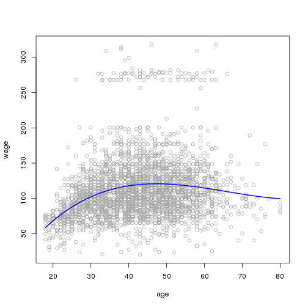
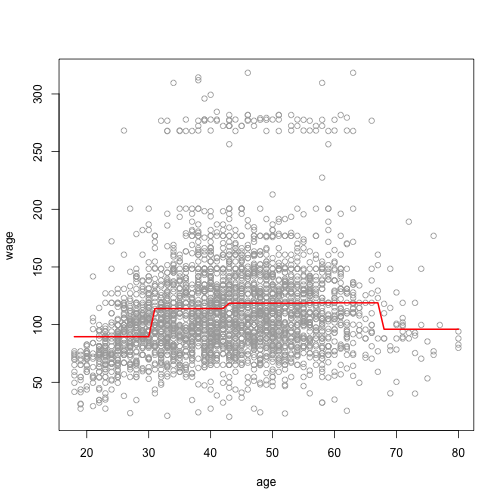

Chapter 7: Exercise 6
========================================================

### a
Load $Wage$ dataset. Keep an array of all cross-validation errors. We are performing K-fold cross validation with $K=10$.

```r
set.seed(1)
library(ISLR)
library(boot)
all.deltas = rep(NA, 10)
for (i in 1:10) {
  glm.fit = glm(wage~poly(age, i), data=Wage)
  all.deltas[i] = cv.glm(Wage, glm.fit, K=10)$delta[2]
}
plot(1:10, all.deltas, xlab="Degree", ylab="CV error", type="l", pch=20, lwd=2, ylim=c(1590, 1700))
min.point = min(all.deltas)
sd.points = sd(all.deltas)
abline(h=min.point + 0.2 * sd.points, col="red", lty="dashed")
abline(h=min.point - 0.2 * sd.points, col="red", lty="dashed")
legend("topright", "0.2-standard deviation lines", lty="dashed", col="red")
```

 

The cv-plot with standard deviation lines show that $d=3$ is the smallest degree giving reasonably small cross-validation error.

We now find best degree using Anova.


```r
fit.1 = lm(wage~poly(age, 1), data=Wage)
fit.2 = lm(wage~poly(age, 2), data=Wage)
fit.3 = lm(wage~poly(age, 3), data=Wage)
fit.4 = lm(wage~poly(age, 4), data=Wage)
fit.5 = lm(wage~poly(age, 5), data=Wage)
fit.6 = lm(wage~poly(age, 6), data=Wage)
fit.7 = lm(wage~poly(age, 7), data=Wage)
fit.8 = lm(wage~poly(age, 8), data=Wage)
fit.9 = lm(wage~poly(age, 9), data=Wage)
fit.10 = lm(wage~poly(age, 10), data=Wage)
anova(fit.1, fit.2, fit.3, fit.4, fit.5, fit.6, fit.7, fit.8, fit.9, fit.10)
```

```
## Analysis of Variance Table
## 
## Model  1: wage ~ poly(age, 1)
## Model  2: wage ~ poly(age, 2)
## Model  3: wage ~ poly(age, 3)
## Model  4: wage ~ poly(age, 4)
## Model  5: wage ~ poly(age, 5)
## Model  6: wage ~ poly(age, 6)
## Model  7: wage ~ poly(age, 7)
## Model  8: wage ~ poly(age, 8)
## Model  9: wage ~ poly(age, 9)
## Model 10: wage ~ poly(age, 10)
##    Res.Df     RSS Df Sum of Sq      F Pr(>F)    
## 1    2998 5022216                               
## 2    2997 4793430  1    228786 143.76 <2e-16 ***
## 3    2996 4777674  1     15756   9.90 0.0017 ** 
## 4    2995 4771604  1      6070   3.81 0.0509 .  
## 5    2994 4770322  1      1283   0.81 0.3694    
## 6    2993 4766389  1      3932   2.47 0.1161    
## 7    2992 4763834  1      2555   1.61 0.2052    
## 8    2991 4763707  1       127   0.08 0.7779    
## 9    2990 4756703  1      7004   4.40 0.0360 *  
## 10   2989 4756701  1         3   0.00 0.9675    
## ---
## Signif. codes:  0 '***' 0.001 '**' 0.01 '*' 0.05 '.' 0.1 ' ' 1
```

Anova shows that all polynomials above degree $3$ are insignificant at $1%$ significance level.

We now plot the polynomial prediction on the data

```r
plot(wage~age, data=Wage, col="darkgrey")
agelims = range(Wage$age)
age.grid = seq(from=agelims[1], to=agelims[2])
lm.fit = lm(wage~poly(age, 3), data=Wage)
lm.pred = predict(lm.fit, data.frame(age=age.grid))
lines(age.grid, lm.pred, col="blue", lwd=2)
```

 


### b
We use cut points of up to 10.

```r
all.cvs = rep(NA, 10)
for (i in 2:10) {
  Wage$age.cut = cut(Wage$age, i)
  lm.fit = glm(wage~age.cut, data=Wage)
  all.cvs[i] = cv.glm(Wage, lm.fit, K=10)$delta[2]
}
plot(2:10, all.cvs[-1], xlab="Number of cuts", ylab="CV error", type="l", pch=20, lwd=2)
```

 

The cross validation shows that test error is minimum for $k=8$ cuts.

We now train the entire data with step function using $8$ cuts and plot it.

```r
lm.fit = glm(wage~cut(age, 8), data=Wage)
agelims = range(Wage$age)
age.grid = seq(from=agelims[1], to=agelims[2])
lm.pred = predict(lm.fit, data.frame(age=age.grid))
plot(wage~age, data=Wage, col="darkgrey")
lines(age.grid, lm.pred, col="red", lwd=2)
```

 

