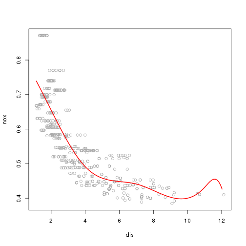

Chapter 6: Exercise 9
========================================================

Load the Boston dataset

```r
set.seed(1)
library(MASS)
attach(Boston)
```


### a


```r
lm.fit = lm(nox ~ poly(dis, 3), data = Boston)
summary(lm.fit)
```

```
## 
## Call:
## lm(formula = nox ~ poly(dis, 3), data = Boston)
## 
## Residuals:
##      Min       1Q   Median       3Q      Max 
## -0.12113 -0.04062 -0.00974  0.02338  0.19490 
## 
## Coefficients:
##               Estimate Std. Error t value Pr(>|t|)    
## (Intercept)    0.55470    0.00276  201.02  < 2e-16 ***
## poly(dis, 3)1 -2.00310    0.06207  -32.27  < 2e-16 ***
## poly(dis, 3)2  0.85633    0.06207   13.80  < 2e-16 ***
## poly(dis, 3)3 -0.31805    0.06207   -5.12  4.3e-07 ***
## ---
## Signif. codes:  0 '***' 0.001 '**' 0.01 '*' 0.05 '.' 0.1 ' ' 1 
## 
## Residual standard error: 0.0621 on 502 degrees of freedom
## Multiple R-squared: 0.715,	Adjusted R-squared: 0.713 
## F-statistic:  419 on 3 and 502 DF,  p-value: <2e-16
```

```r
dislim = range(dis)
dis.grid = seq(from = dislim[1], to = dislim[2], by = 0.1)
lm.pred = predict(lm.fit, list(dis = dis.grid))
plot(nox ~ dis, data = Boston, col = "darkgrey")
lines(dis.grid, lm.pred, col = "red", lwd = 2)
```

 


Summary shows that all polynomial terms are significant while predicting nox using dis. Plot shows a smooth curve fitting the data fairly well.


### b
We plot polynomials of degrees 1 to 10 and save train RSS.

```r
all.rss = rep(NA, 10)
for (i in 1:10) {
    lm.fit = lm(nox ~ poly(dis, i), data = Boston)
    all.rss[i] = sum(lm.fit$residuals^2)
}
all.rss
```

```
##  [1] 2.769 2.035 1.934 1.933 1.915 1.878 1.849 1.836 1.833 1.832
```

As expected, train RSS monotonically decreases with degree of polynomial. 

### c
We use a 10-fold cross validation to pick the best polynomial degree.

```r
library(boot)
all.deltas = rep(NA, 10)
for (i in 1:10) {
    glm.fit = glm(nox ~ poly(dis, i), data = Boston)
    all.deltas[i] = cv.glm(Boston, glm.fit, K = 10)$delta[2]
}
plot(1:10, all.deltas, xlab = "Degree", ylab = "CV error", type = "l", pch = 20, 
    lwd = 2)
```

 

A 10-fold CV shows that the CV error reduces as we increase degree from 1 to 3, stay almost constant till degree 5, and the starts increasing for higher degrees. We pick 4 as the best polynomial degree.

### d
We see that dis has limits of about 1 and 13 respectively. We split this range in roughly equal 4 intervals and establish knots at $[4, 7, 11]$. Note: bs function in R expects either df or knots argument. If both are specified, knots are ignored.

```r
library(splines)
sp.fit = lm(nox ~ bs(dis, df = 4, knots = c(4, 7, 11)), data = Boston)
summary(sp.fit)
```

```
## 
## Call:
## lm(formula = nox ~ bs(dis, df = 4, knots = c(4, 7, 11)), data = Boston)
## 
## Residuals:
##     Min      1Q  Median      3Q     Max 
## -0.1246 -0.0403 -0.0087  0.0247  0.1929 
## 
## Coefficients:
##                                       Estimate Std. Error t value Pr(>|t|)
## (Intercept)                             0.7393     0.0133   55.54  < 2e-16
## bs(dis, df = 4, knots = c(4, 7, 11))1  -0.0886     0.0250   -3.54  0.00044
## bs(dis, df = 4, knots = c(4, 7, 11))2  -0.3134     0.0168  -18.66  < 2e-16
## bs(dis, df = 4, knots = c(4, 7, 11))3  -0.2662     0.0315   -8.46  3.0e-16
## bs(dis, df = 4, knots = c(4, 7, 11))4  -0.3980     0.0465   -8.56  < 2e-16
## bs(dis, df = 4, knots = c(4, 7, 11))5  -0.2568     0.0900   -2.85  0.00451
## bs(dis, df = 4, knots = c(4, 7, 11))6  -0.3293     0.0633   -5.20  2.9e-07
##                                          
## (Intercept)                           ***
## bs(dis, df = 4, knots = c(4, 7, 11))1 ***
## bs(dis, df = 4, knots = c(4, 7, 11))2 ***
## bs(dis, df = 4, knots = c(4, 7, 11))3 ***
## bs(dis, df = 4, knots = c(4, 7, 11))4 ***
## bs(dis, df = 4, knots = c(4, 7, 11))5 ** 
## bs(dis, df = 4, knots = c(4, 7, 11))6 ***
## ---
## Signif. codes:  0 '***' 0.001 '**' 0.01 '*' 0.05 '.' 0.1 ' ' 1 
## 
## Residual standard error: 0.0619 on 499 degrees of freedom
## Multiple R-squared: 0.718,	Adjusted R-squared: 0.715 
## F-statistic:  212 on 6 and 499 DF,  p-value: <2e-16
```

```r
sp.pred = predict(sp.fit, list(dis = dis.grid))
plot(nox ~ dis, data = Boston, col = "darkgrey")
lines(dis.grid, sp.pred, col = "red", lwd = 2)
```

 

The summary shows that all terms in spline fit are significant. Plot shows that the spline fits data well except at the extreme values of $dis$, (especially $dis > 10$). 

### e
We fit regression splines with dfs between 3 and 16. 

```r
all.cv = rep(NA, 16)
for (i in 3:16) {
    lm.fit = lm(nox ~ bs(dis, df = i), data = Boston)
    all.cv[i] = sum(lm.fit$residuals^2)
}
all.cv[-c(1, 2)]
```

```
##  [1] 1.934 1.923 1.840 1.834 1.830 1.817 1.826 1.793 1.797 1.789 1.782
## [12] 1.782 1.783 1.784
```

Train RSS monotonically decreases till df=14 and then slightly increases for df=15 and df=16.

### f
Finally, we use a 10-fold cross validation to find best df. We try all integer values of df between 3 and 16.

```r
all.cv = rep(NA, 16)
for (i in 3:16) {
    lm.fit = glm(nox ~ bs(dis, df = i), data = Boston)
    all.cv[i] = cv.glm(Boston, lm.fit, K = 10)$delta[2]
}
```

```
## Warning: some 'x' values beyond boundary knots may cause ill-conditioned bases
## Warning: some 'x' values beyond boundary knots may cause ill-conditioned bases
## Warning: some 'x' values beyond boundary knots may cause ill-conditioned bases
## Warning: some 'x' values beyond boundary knots may cause ill-conditioned bases
## Warning: some 'x' values beyond boundary knots may cause ill-conditioned bases
## Warning: some 'x' values beyond boundary knots may cause ill-conditioned bases
## Warning: some 'x' values beyond boundary knots may cause ill-conditioned bases
## Warning: some 'x' values beyond boundary knots may cause ill-conditioned bases
## Warning: some 'x' values beyond boundary knots may cause ill-conditioned bases
## Warning: some 'x' values beyond boundary knots may cause ill-conditioned bases
## Warning: some 'x' values beyond boundary knots may cause ill-conditioned bases
## Warning: some 'x' values beyond boundary knots may cause ill-conditioned bases
## Warning: some 'x' values beyond boundary knots may cause ill-conditioned bases
## Warning: some 'x' values beyond boundary knots may cause ill-conditioned bases
## Warning: some 'x' values beyond boundary knots may cause ill-conditioned bases
## Warning: some 'x' values beyond boundary knots may cause ill-conditioned bases
## Warning: some 'x' values beyond boundary knots may cause ill-conditioned bases
## Warning: some 'x' values beyond boundary knots may cause ill-conditioned bases
## Warning: some 'x' values beyond boundary knots may cause ill-conditioned bases
## Warning: some 'x' values beyond boundary knots may cause ill-conditioned bases
## Warning: some 'x' values beyond boundary knots may cause ill-conditioned bases
## Warning: some 'x' values beyond boundary knots may cause ill-conditioned bases
## Warning: some 'x' values beyond boundary knots may cause ill-conditioned bases
## Warning: some 'x' values beyond boundary knots may cause ill-conditioned bases
## Warning: some 'x' values beyond boundary knots may cause ill-conditioned bases
## Warning: some 'x' values beyond boundary knots may cause ill-conditioned bases
## Warning: some 'x' values beyond boundary knots may cause ill-conditioned bases
## Warning: some 'x' values beyond boundary knots may cause ill-conditioned bases
## Warning: some 'x' values beyond boundary knots may cause ill-conditioned bases
## Warning: some 'x' values beyond boundary knots may cause ill-conditioned bases
## Warning: some 'x' values beyond boundary knots may cause ill-conditioned bases
## Warning: some 'x' values beyond boundary knots may cause ill-conditioned bases
## Warning: some 'x' values beyond boundary knots may cause ill-conditioned bases
## Warning: some 'x' values beyond boundary knots may cause ill-conditioned bases
## Warning: some 'x' values beyond boundary knots may cause ill-conditioned bases
## Warning: some 'x' values beyond boundary knots may cause ill-conditioned bases
## Warning: some 'x' values beyond boundary knots may cause ill-conditioned bases
## Warning: some 'x' values beyond boundary knots may cause ill-conditioned bases
## Warning: some 'x' values beyond boundary knots may cause ill-conditioned bases
## Warning: some 'x' values beyond boundary knots may cause ill-conditioned bases
## Warning: some 'x' values beyond boundary knots may cause ill-conditioned bases
## Warning: some 'x' values beyond boundary knots may cause ill-conditioned bases
## Warning: some 'x' values beyond boundary knots may cause ill-conditioned bases
## Warning: some 'x' values beyond boundary knots may cause ill-conditioned bases
## Warning: some 'x' values beyond boundary knots may cause ill-conditioned bases
## Warning: some 'x' values beyond boundary knots may cause ill-conditioned bases
## Warning: some 'x' values beyond boundary knots may cause ill-conditioned bases
## Warning: some 'x' values beyond boundary knots may cause ill-conditioned bases
## Warning: some 'x' values beyond boundary knots may cause ill-conditioned bases
## Warning: some 'x' values beyond boundary knots may cause ill-conditioned bases
## Warning: some 'x' values beyond boundary knots may cause ill-conditioned bases
## Warning: some 'x' values beyond boundary knots may cause ill-conditioned bases
## Warning: some 'x' values beyond boundary knots may cause ill-conditioned bases
## Warning: some 'x' values beyond boundary knots may cause ill-conditioned bases
```

```r
plot(3:16, all.cv[-c(1, 2)], lwd = 2, type = "l", xlab = "df", ylab = "CV error")
```

 

CV error is more jumpy in this case, but attains minimum at df=10. We pick $10$ as the optimal degrees of freedom.
