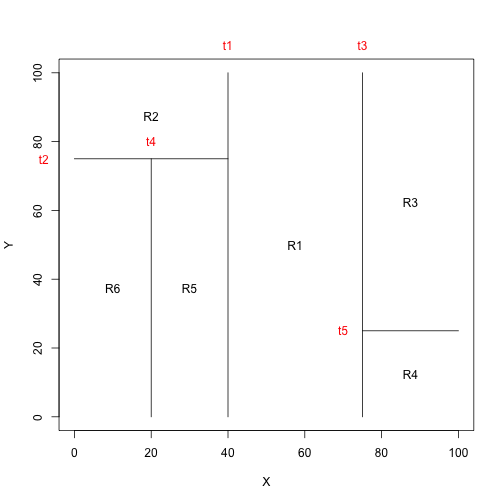

Chapter 8: Exercise 1
========================================================


```r
par(xpd = NA)
plot(NA, NA, type = "n", xlim = c(0, 100), ylim = c(0, 100), xlab = "X", ylab = "Y")
# t1: x = 40; (40, 0) (40, 100)
lines(x = c(40, 40), y = c(0, 100))
text(x = 40, y = 108, labels = c("t1"), col = "red")
# t2: y = 75; (0, 75) (40, 75)
lines(x = c(0, 40), y = c(75, 75))
text(x = -8, y = 75, labels = c("t2"), col = "red")
# t3: x = 75; (75,0) (75, 100)
lines(x = c(75, 75), y = c(0, 100))
text(x = 75, y = 108, labels = c("t3"), col = "red")
# t4: x = 20; (20,0) (20, 75)
lines(x = c(20, 20), y = c(0, 75))
text(x = 20, y = 80, labels = c("t4"), col = "red")
# t5: y=25; (75,25) (100,25)
lines(x = c(75, 100), y = c(25, 25))
text(x = 70, y = 25, labels = c("t5"), col = "red")

text(x = (40 + 75)/2, y = 50, labels = c("R1"))
text(x = 20, y = (100 + 75)/2, labels = c("R2"))
text(x = (75 + 100)/2, y = (100 + 25)/2, labels = c("R3"))
text(x = (75 + 100)/2, y = 25/2, labels = c("R4"))
text(x = 30, y = 75/2, labels = c("R5"))
text(x = 10, y = 75/2, labels = c("R6"))
```

 


```
        [  X<40 ] 
        |       |
    [Y<75]    [X<75]
    |   |     |    |
 [X<20] R2    R1   [Y<25]
 |    |            |    |
 R6   R5           R4   R3
```


