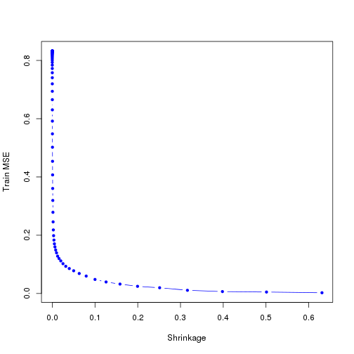
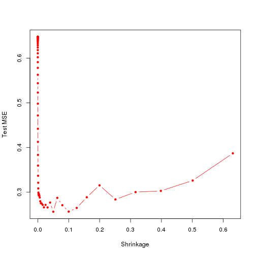
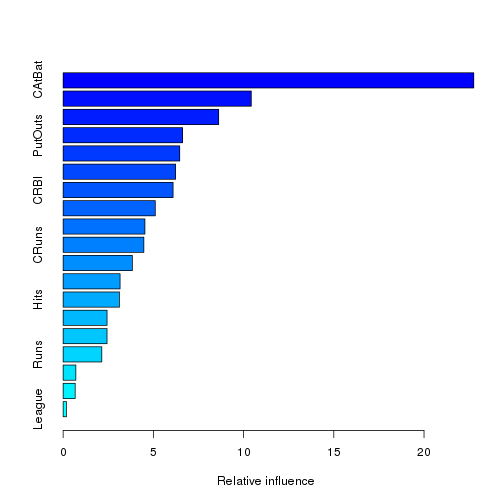

Chapter 8: Exercise 10
========================================================

### a

```r
library(ISLR)
sum(is.na(Hitters$Salary))
```

```
## [1] 59
```

```r
Hitters = Hitters[-which(is.na(Hitters$Salary)), ]
sum(is.na(Hitters$Salary))
```

```
## [1] 0
```

```r
Hitters$Salary = log(Hitters$Salary)
```


### b

```r
train = 1:200
Hitters.train = Hitters[train, ]
Hitters.test = Hitters[-train, ]
```


### c

```r
library(gbm)
```

```
## Loading required package: survival
## Loading required package: splines
## Loading required package: lattice
## Loading required package: parallel
## Loaded gbm 2.1
```

```r
set.seed(103)
pows = seq(-10, -0.2, by = 0.1)
lambdas = 10^pows
length.lambdas = length(lambdas)
train.errors = rep(NA, length.lambdas)
test.errors = rep(NA, length.lambdas)
for (i in 1:length.lambdas) {
    boost.hitters = gbm(Salary ~ ., data = Hitters.train, distribution = "gaussian", 
        n.trees = 1000, shrinkage = lambdas[i])
    train.pred = predict(boost.hitters, Hitters.train, n.trees = 1000)
    test.pred = predict(boost.hitters, Hitters.test, n.trees = 1000)
    train.errors[i] = mean((Hitters.train$Salary - train.pred)^2)
    test.errors[i] = mean((Hitters.test$Salary - test.pred)^2)
}

plot(lambdas, train.errors, type = "b", xlab = "Shrinkage", ylab = "Train MSE", 
    col = "blue", pch = 20)
```

 


### d

```r
plot(lambdas, test.errors, type = "b", xlab = "Shrinkage", ylab = "Test MSE", 
    col = "red", pch = 20)
```

 

```r
min(test.errors)
```

```
## [1] 0.2561
```

```r
lambdas[which.min(test.errors)]
```

```
## [1] 0.05012
```

Minimum test error is obtained at $\lambda = 0.05$.

### e

```r
lm.fit = lm(Salary ~ ., data = Hitters.train)
lm.pred = predict(lm.fit, Hitters.test)
mean((Hitters.test$Salary - lm.pred)^2)
```

```
## [1] 0.4918
```

```r
library(glmnet)
```

```
## Loading required package: Matrix
## Loaded glmnet 1.9-5
```

```r
set.seed(134)
x = model.matrix(Salary ~ ., data = Hitters.train)
y = Hitters.train$Salary
x.test = model.matrix(Salary ~ ., data = Hitters.test)
lasso.fit = glmnet(x, y, alpha = 1)
lasso.pred = predict(lasso.fit, s = 0.01, newx = x.test)
mean((Hitters.test$Salary - lasso.pred)^2)
```

```
## [1] 0.4701
```

Both linear model and regularization like Lasso have higher test MSE than boosting.

### f

```r
boost.best = gbm(Salary ~ ., data = Hitters.train, distribution = "gaussian", 
    n.trees = 1000, shrinkage = lambdas[which.min(test.errors)])
summary(boost.best)
```

 

```
##                 var rel.inf
## CAtBat       CAtBat 22.7563
## CWalks       CWalks 10.4280
## CHits         CHits  8.6198
## PutOuts     PutOuts  6.6159
## Years         Years  6.4612
## Walks         Walks  6.2331
## CRBI           CRBI  6.0927
## CHmRun       CHmRun  5.1076
## RBI             RBI  4.5322
## CRuns         CRuns  4.4728
## Assists     Assists  3.8367
## HmRun         HmRun  3.1554
## Hits           Hits  3.1229
## AtBat         AtBat  2.4339
## Errors       Errors  2.4324
## Runs           Runs  2.1425
## Division   Division  0.7042
## NewLeague NewLeague  0.6675
## League       League  0.1849
```

$\tt{CAtBat}$, $\tt{CRBI}$ and $\tt{CWalks}$ are three most important variables in that order.

### g

```r
library(randomForest)
```

```
## randomForest 4.6-7
## Type rfNews() to see new features/changes/bug fixes.
```

```r
set.seed(21)
rf.hitters = randomForest(Salary ~ ., data = Hitters.train, ntree = 500, mtry = 19)
rf.pred = predict(rf.hitters, Hitters.test)
mean((Hitters.test$Salary - rf.pred)^2)
```

```
## [1] 0.2298
```

Test MSE for bagging is about $0.23$, which is slightly lower than the best test MSE for boosting.
