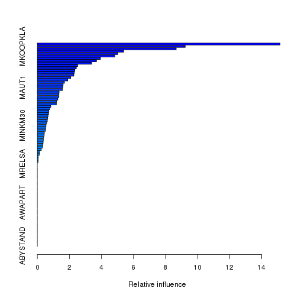

Chapter 8: Exercise 11
========================================================

### a

```r
library(ISLR)
train = 1:1000
Caravan$Purchase = ifelse(Caravan$Purchase == "Yes", 1, 0)
Caravan.train = Caravan[train, ]
Caravan.test = Caravan[-train, ]
```


### b

```r
library(gbm)
```

```
## Loading required package: survival
## Loading required package: splines
## Loading required package: lattice
## Loading required package: parallel
## Loaded gbm 2.1
```

```r
set.seed(342)
boost.caravan = gbm(Purchase ~ ., data = Caravan.train, n.trees = 1000, shrinkage = 0.01, 
    distribution = "bernoulli")
```

```
## Warning: variable 50: PVRAAUT has no variation.
## Warning: variable 71: AVRAAUT has no variation.
```

```r
summary(boost.caravan)
```

 

```
##               var  rel.inf
## PPERSAUT PPERSAUT 15.15534
## MKOOPKLA MKOOPKLA  9.23500
## MOPLHOOG MOPLHOOG  8.67017
## MBERMIDD MBERMIDD  5.39404
## MGODGE     MGODGE  5.03048
## PBRAND     PBRAND  4.83740
## MINK3045 MINK3045  3.94305
## ABRAND     ABRAND  3.69693
## MOSTYPE   MOSTYPE  3.38769
## PWAPART   PWAPART  2.51970
## MGODPR     MGODPR  2.43689
## MSKC         MSKC  2.34595
## MAUT2       MAUT2  2.30973
## MFWEKIND MFWEKIND  2.27960
## MBERARBG MBERARBG  2.08245
## MSKA         MSKA  1.90021
## PBYSTAND PBYSTAND  1.69482
## MGODOV     MGODOV  1.61148
## MAUT1       MAUT1  1.59879
## MBERHOOG MBERHOOG  1.56791
## MINK7512 MINK7512  1.36255
## MSKB1       MSKB1  1.35071
## MINKGEM   MINKGEM  1.34913
## MRELGE     MRELGE  1.28204
## MAUT0       MAUT0  1.19930
## MHHUUR     MHHUUR  1.19159
## MFGEKIND MFGEKIND  0.84203
## MRELOV     MRELOV  0.78555
## MZPART     MZPART  0.72191
## MINK4575 MINK4575  0.70936
## MSKB2       MSKB2  0.66694
## APERSAUT APERSAUT  0.64645
## MGODRK     MGODRK  0.62381
## MSKD         MSKD  0.58168
## MINKM30   MINKM30  0.54393
## PMOTSCO   PMOTSCO  0.52709
## MOPLMIDD MOPLMIDD  0.52092
## MGEMOMV   MGEMOMV  0.44231
## MZFONDS   MZFONDS  0.43038
## PLEVEN     PLEVEN  0.39902
## MHKOOP     MHKOOP  0.37672
## MBERARBO MBERARBO  0.36653
## MBERBOER MBERBOER  0.35290
## MINK123M MINK123M  0.33559
## MGEMLEEF MGEMLEEF  0.24938
## MFALLEEN MFALLEEN  0.14899
## MOSHOOFD MOSHOOFD  0.13265
## MOPLLAAG MOPLLAAG  0.05655
## MBERZELF MBERZELF  0.05589
## MAANTHUI MAANTHUI  0.05048
## MRELSA     MRELSA  0.00000
## PWABEDR   PWABEDR  0.00000
## PWALAND   PWALAND  0.00000
## PBESAUT   PBESAUT  0.00000
## PVRAAUT   PVRAAUT  0.00000
## PAANHANG PAANHANG  0.00000
## PTRACTOR PTRACTOR  0.00000
## PWERKT     PWERKT  0.00000
## PBROM       PBROM  0.00000
## PPERSONG PPERSONG  0.00000
## PGEZONG   PGEZONG  0.00000
## PWAOREG   PWAOREG  0.00000
## PZEILPL   PZEILPL  0.00000
## PPLEZIER PPLEZIER  0.00000
## PFIETS     PFIETS  0.00000
## PINBOED   PINBOED  0.00000
## AWAPART   AWAPART  0.00000
## AWABEDR   AWABEDR  0.00000
## AWALAND   AWALAND  0.00000
## ABESAUT   ABESAUT  0.00000
## AMOTSCO   AMOTSCO  0.00000
## AVRAAUT   AVRAAUT  0.00000
## AAANHANG AAANHANG  0.00000
## ATRACTOR ATRACTOR  0.00000
## AWERKT     AWERKT  0.00000
## ABROM       ABROM  0.00000
## ALEVEN     ALEVEN  0.00000
## APERSONG APERSONG  0.00000
## AGEZONG   AGEZONG  0.00000
## AWAOREG   AWAOREG  0.00000
## AZEILPL   AZEILPL  0.00000
## APLEZIER APLEZIER  0.00000
## AFIETS     AFIETS  0.00000
## AINBOED   AINBOED  0.00000
## ABYSTAND ABYSTAND  0.00000
```

$\tt{PPERSAUT}$, $\tt{MKOOPKLA}$ and $\tt{MOPLHOOG}$ are three most important variables in that order.

### c

```r
boost.prob = predict(boost.caravan, Caravan.test, n.trees = 1000, type = "response")
boost.pred = ifelse(boost.prob > 0.2, 1, 0)
table(Caravan.test$Purchase, boost.pred)
```

```
##    boost.pred
##        0    1
##   0 4396  137
##   1  255   34
```

```r
34/(137 + 34)
```

```
## [1] 0.1988
```

About $20$% of people predicted to make purchase actually end up making one.

```r
lm.caravan = glm(Purchase ~ ., data = Caravan.train, family = binomial)
```

```
## Warning: glm.fit: fitted probabilities numerically 0 or 1 occurred
```

```r
lm.prob = predict(lm.caravan, Caravan.test, type = "response")
```

```
## Warning: prediction from a rank-deficient fit may be misleading
```

```r
lm.pred = ifelse(lm.prob > 0.2, 1, 0)
table(Caravan.test$Purchase, lm.pred)
```

```
##    lm.pred
##        0    1
##   0 4183  350
##   1  231   58
```

```r
58/(350 + 58)
```

```
## [1] 0.1422
```

About $14$% of people predicted to make purchase using logistic regression actually end up making one. This is lower than boosting.
