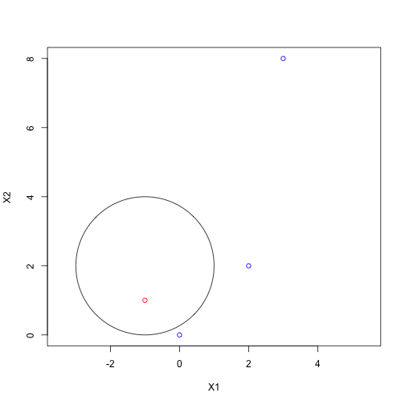

Chapter 9: Exercise 2
=====================

$(1+X_1)^2 + (2-X_2)^2 = 4$ is a circle with radius 2 and center (-1, 2).

## a

```r
radius = 2
plot(NA, NA, type = "n", xlim = c(-4, 2), ylim = c(-1, 5), asp = 1, xlab = "X1", 
    ylab = "X2")
symbols(c(-1), c(2), circles = c(radius), add = TRUE, inches = FALSE)
```

 


## b

```r
radius = 2
plot(NA, NA, type = "n", xlim = c(-4, 2), ylim = c(-1, 5), asp = 1, xlab = "X1", 
    ylab = "X2")
symbols(c(-1), c(2), circles = c(radius), add = TRUE, inches = FALSE)
text(c(-1), c(2), "< 4")
text(c(-4), c(2), "> 4")
```

 


## c
To restate the boundary, outside the circle is blue, inside and on is red.


```r
radius = 2
plot(c(0, -1, 2, 3), c(0, 1, 2, 8), col = c("blue", "red", "blue", "blue"), 
    type = "p", asp = 1, xlab = "X1", ylab = "X2")
symbols(c(-1), c(2), circles = c(radius), add = TRUE, inches = FALSE)
```

 


## d
The decision boundary is a sum of quadratic terms when expanded.

$$
(1+X_1)^2 + (2-X_2)^2 > 4 \\
1 + 2 X_1 + X_1^2 + 4 - 4 X_2 + X_2^2 > 4 \\
5 + 2 X_1 - 4 X_2 + X_1^2 + X_2^2 > 4
$$
