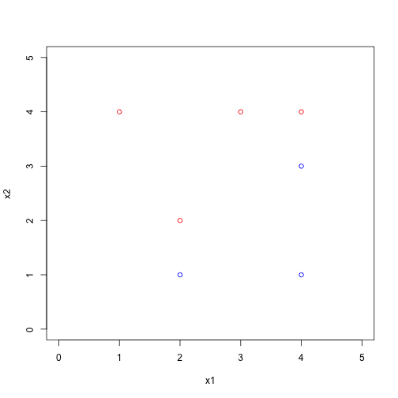
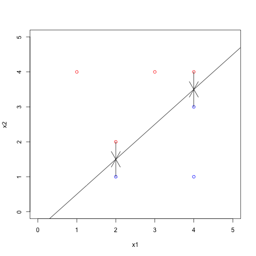
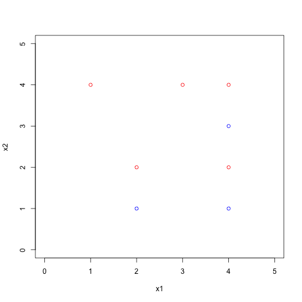

Chapter 9: Exercise 3
=====================

## a


```r
x1 = c(3, 2, 4, 1, 2, 4, 4)
x2 = c(4, 2, 4, 4, 1, 3, 1)
colors = c("red", "red", "red", "red", "blue", "blue", "blue")
plot(x1, x2, col = colors, xlim = c(0, 5), ylim = c(0, 5))
```

 


## b
The maximal margin classifier has to be in between observations #2, #3 and #5, #6.

$$
(2,2), (4,4) \\
(2,1), (4,3) \\
=> (2,1.5), (4,3.5) \\
b = (3.5 - 1.5) / (4 - 2) = 1 \\
a = X_2 - X_1 = 1.5 - 2 = -0.5
$$


```r
plot(x1, x2, col = colors, xlim = c(0, 5), ylim = c(0, 5))
abline(-0.5, 1)
```

 


## c
$0.5 - X_1 + X_2 > 0$

## d

```r
plot(x1, x2, col = colors, xlim = c(0, 5), ylim = c(0, 5))
abline(-0.5, 1)
abline(-1, 1, lty = 2)
abline(0, 1, lty = 2)
```

 


## e

```r
plot(x1, x2, col = colors, xlim = c(0, 5), ylim = c(0, 5))
abline(-0.5, 1)
arrows(2, 1, 2, 1.5)
arrows(2, 2, 2, 1.5)
arrows(4, 4, 4, 3.5)
arrows(4, 3, 4, 3.5)
```

 


## f
A slight movement of observation #7 (4,1) blue would not have an effect on the
maximal margin hyperplane since its movement would be outside of the margin.

## g

```r
plot(x1, x2, col = colors, xlim = c(0, 5), ylim = c(0, 5))
abline(-0.8, 1)
```

 

$-0.8 - X_1 + X_2 > 0$ 

## h

```r
plot(x1, x2, col = colors, xlim = c(0, 5), ylim = c(0, 5))
points(c(4), c(2), col = c("red"))
```

 

