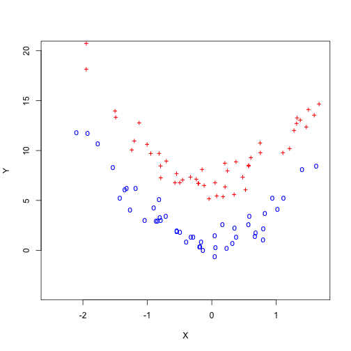
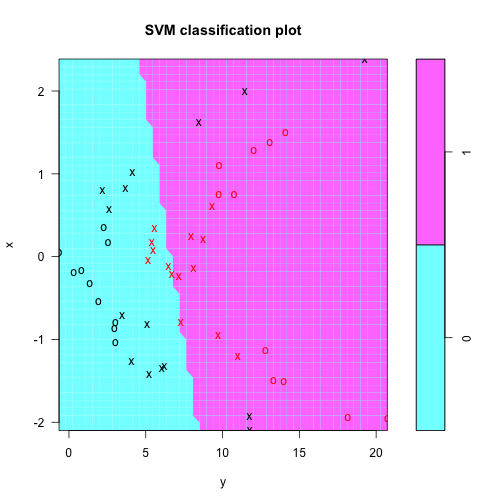
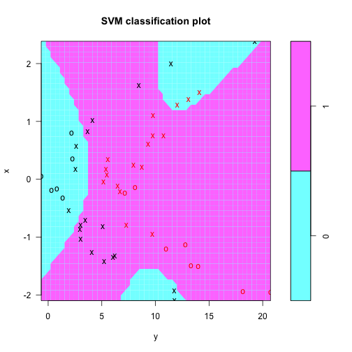
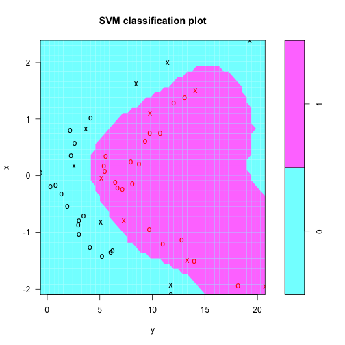
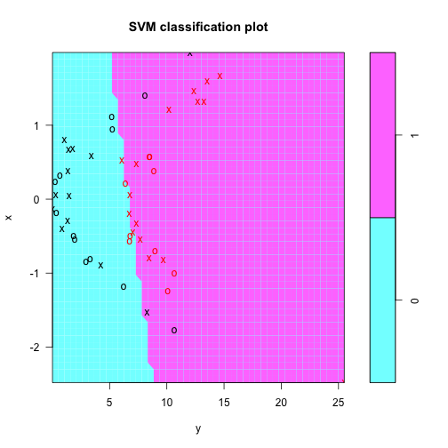
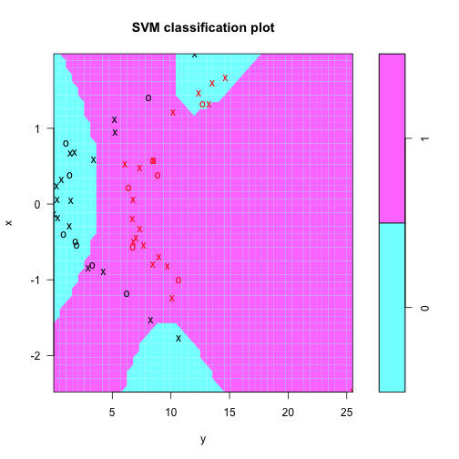
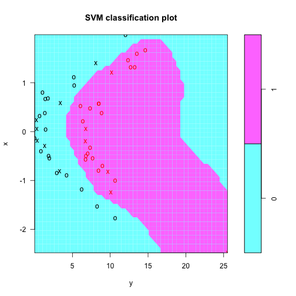

Chapter 9: Exercise 4
========================================================

We create a random initial dataset which lies along the parabola $y = 3*x^2 + 4$. We then separate the two classes by translating them along Y-axis.


```r
set.seed(131)
x = rnorm(100)
y = 3 * x^2 + 4 + rnorm(100)
train = sample(100, 50)
y[train] = y[train] + 3
y[-train] = y[-train] - 3
# Plot using different colors
plot(x[train], y[train], pch="+", lwd=4, col="red", ylim=c(-4, 20), xlab="X", ylab="Y")
points(x[-train], y[-train], pch="o", lwd=4, col="blue")
```

 


The plot clearly shows non-linear separation. We now create both train and test dataframes by taking half of positive and negative classes and creating a new `z` vector of 0 and 1 for classes. 

```r
set.seed(315)
z = rep(0, 100)
z[train] = 1
# Take 25 observations each from train and -train
final.train = c(sample(train, 25), sample(setdiff(1:100, train), 25))
data.train = data.frame(x=x[final.train], y=y[final.train], z=as.factor(z[final.train]))
data.test = data.frame(x=x[-final.train], y=y[-final.train], z=as.factor(z[-final.train]))
library(e1071)
```

```
## Loading required package: class
```

```r
svm.linear = svm(z~., data=data.train, kernel="linear", cost=10)
plot(svm.linear, data.train)
```

 

```r
table(z[final.train], predict(svm.linear, data.train))
```

```
##    
##      0  1
##   0 20  5
##   1  5 20
```

The plot shows the linear boundary. The classifier makes $10$ classification errors on train data.

Next, we train an SVM with polynomial kernel

```r
set.seed(32545)
svm.poly = svm(z~., data=data.train, kernel="polynomial", cost=10)
plot(svm.poly, data.train)
```

 

```r
table(z[final.train], predict(svm.poly, data.train))
```

```
##    
##      0  1
##   0 13 12
##   1  3 22
```

This is a default polynomial kernel with degree 3. It makes $15$ errors on train data.

Finally, we train an SVM with radial basis kernel with gamma of 1.

```r
set.seed(996)
svm.radial = svm(z~., data=data.train, kernel="radial", gamma=1, cost=10)
plot(svm.radial, data.train)
```

 

```r
table(z[final.train], predict(svm.radial, data.train))
```

```
##    
##      0  1
##   0 25  0
##   1  0 25
```

This classifier perfectly classifies train data!.

Here are how the test errors look like.

```r
plot(svm.linear, data.test)
```

 

```r
plot(svm.poly, data.test)
```

 

```r
plot(svm.radial, data.test)
```

 

```r
table(z[-final.train], predict(svm.linear, data.test))
```

```
##    
##      0  1
##   0 21  4
##   1  2 23
```

```r
table(z[-final.train], predict(svm.poly, data.test))
```

```
##    
##      0  1
##   0 16  9
##   1  5 20
```

```r
table(z[-final.train], predict(svm.radial, data.test))
```

```
##    
##      0  1
##   0 25  0
##   1  0 25
```

The tables show that linear, polynomial and radial basis kernels classify 6, 14, and 0 test points incorrectly respectively. Radial basis kernel is the best and has a zero test misclassification error. 
