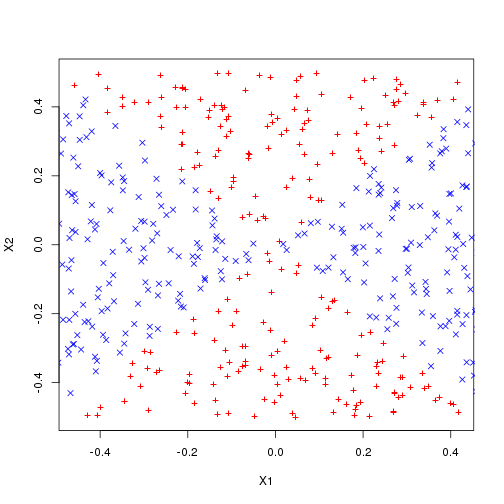
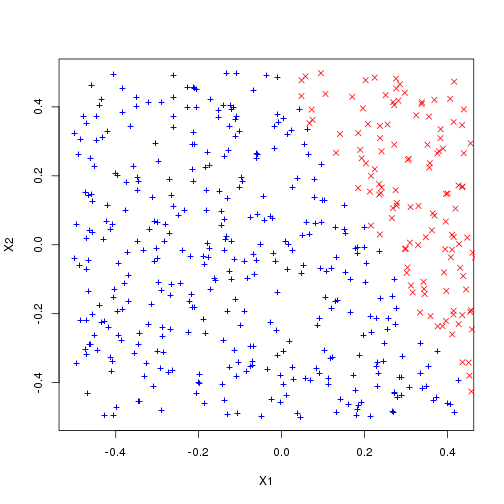
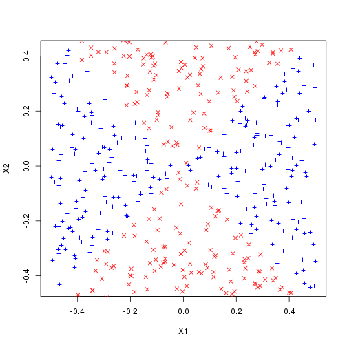
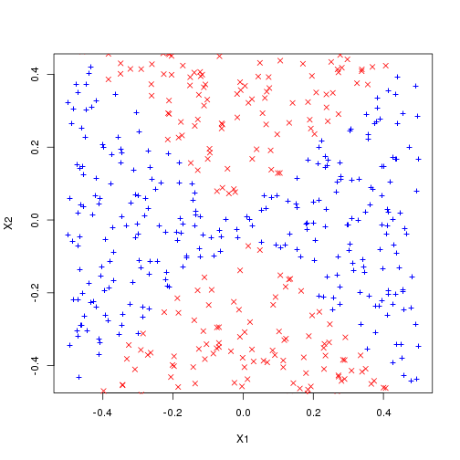

Chapter 9: Exercise 5
========================================================

### a

```r
set.seed(421)
x1 = runif(500) - 0.5
x2 = runif(500) - 0.5
y = 1 * (x1^2 - x2^2 > 0)
```


### b

```r
plot(x1[y == 0], x2[y == 0], col = "red", xlab = "X1", ylab = "X2", pch = "+")
points(x1[y == 1], x2[y == 1], col = "blue", pch = 4)
```

 

The plot clearly shows non-linear decision boundary.

### c

```r
lm.fit = glm(y ~ x1 + x2, family = binomial)
summary(lm.fit)
```

```
## 
## Call:
## glm(formula = y ~ x1 + x2, family = binomial)
## 
## Deviance Residuals: 
##    Min      1Q  Median      3Q     Max  
##  -1.28   -1.23    1.09    1.13    1.17  
## 
## Coefficients:
##             Estimate Std. Error z value Pr(>|z|)
## (Intercept)   0.1200     0.0897    1.34     0.18
## x1           -0.1688     0.3085   -0.55     0.58
## x2           -0.0820     0.3148   -0.26     0.79
## 
## (Dispersion parameter for binomial family taken to be 1)
## 
##     Null deviance: 691.35  on 499  degrees of freedom
## Residual deviance: 690.99  on 497  degrees of freedom
## AIC: 697
## 
## Number of Fisher Scoring iterations: 3
```

Both variables are insignificant for predicting $y$.

### d

```r
data = data.frame(x1 = x1, x2 = x2, y = y)
lm.prob = predict(lm.fit, data, type = "response")
lm.pred = ifelse(lm.prob > 0.52, 1, 0)
data.pos = data[lm.pred == 1, ]
data.neg = data[lm.pred == 0, ]
plot(data.pos$x1, data.pos$x2, col = "blue", xlab = "X1", ylab = "X2", pch = "+")
points(data.neg$x1, data.neg$x2, col = "red", pch = 4)
```

 

With the given model and a probability threshold of 0.5, all points are classified to single class and no decision boundary can be shown. Hence we shift the probability threshold to 0.52 to show a meaningful decision boundary. This boundary is linear as seen in the figure.

### e
We use squares, product interaction terms to fit the model.

```r
lm.fit = glm(y ~ poly(x1, 2) + poly(x2, 2) + I(x1 * x2), data = data, family = binomial)
```

```
## Warning: glm.fit: algorithm did not converge
## Warning: glm.fit: fitted probabilities numerically 0 or 1 occurred
```


### f

```r
lm.prob = predict(lm.fit, data, type = "response")
lm.pred = ifelse(lm.prob > 0.5, 1, 0)
data.pos = data[lm.pred == 1, ]
data.neg = data[lm.pred == 0, ]
plot(data.pos$x1, data.pos$x2, col = "blue", xlab = "X1", ylab = "X2", pch = "+")
points(data.neg$x1, data.neg$x2, col = "red", pch = 4)
```

 

This non-linear decision boundary closely resembles the true decision boundary.

### g

```r
library(e1071)
```

```
## Loading required package: class
```

```r
svm.fit = svm(as.factor(y) ~ x1 + x2, data, kernel = "linear", cost = 0.1)
svm.pred = predict(svm.fit, data)
data.pos = data[svm.pred == 1, ]
data.neg = data[svm.pred == 0, ]
plot(data.pos$x1, data.pos$x2, col = "blue", xlab = "X1", ylab = "X2", pch = "+")
points(data.neg$x1, data.neg$x2, col = "red", pch = 4)
```

 

A linear kernel, even with low cost fails to find non-linear decision boundary and classifies all points to a single class.

### h

```r
svm.fit = svm(as.factor(y) ~ x1 + x2, data, gamma = 1)
svm.pred = predict(svm.fit, data)
data.pos = data[svm.pred == 1, ]
data.neg = data[svm.pred == 0, ]
plot(data.pos$x1, data.pos$x2, col = "blue", xlab = "X1", ylab = "X2", pch = "+")
points(data.neg$x1, data.neg$x2, col = "red", pch = 4)
```

 

Again, the non-linear decision boundary on predicted labels closely resembles the true decision boundary.

### i
This experiment enforces the idea that SVMs with non-linear kernel are extremely powerful in finding non-linear boundary. Both, logistic regression with non-interactions and SVMs with linear kernels fail to find the decision boundary. Adding interaction terms to logistic regression seems to give them same power as radial-basis kernels. However, there is some manual efforts and tuning involved in picking right interaction terms. This effort can become prohibitive with large number of features. Radial basis kernels, on the other hand, only require tuning of one parameter - gamma - which can be easily done using cross-validation.
