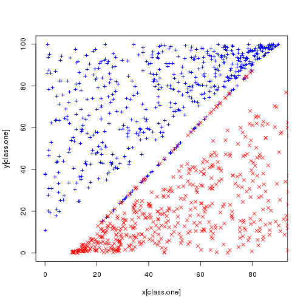
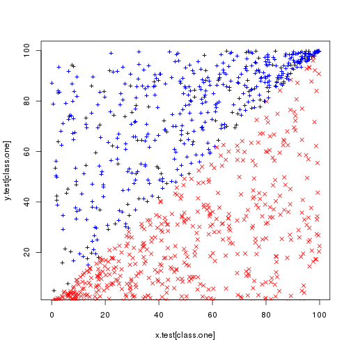

Chapter 9: Exercise 6
========================================================

### a
We randomly generate 1000 points and scatter them across line $x = y$ with wide margin. We also create noisy points along the line $5x -4y - 50 = 0$. These points make the classes barely separable and also shift the maximum margin classifier.

```r
set.seed(3154)
# Class one
x.one = runif(500, 0, 90)
y.one = runif(500, x.one + 10, 100)
x.one.noise = runif(50, 20, 80)
y.one.noise = 5/4 * (x.one.noise - 10) + 0.1

# Class zero
x.zero = runif(500, 10, 100)
y.zero = runif(500, 0, x.zero - 10)
x.zero.noise = runif(50, 20, 80)
y.zero.noise = 5/4 * (x.zero.noise - 10) - 0.1

# Combine all
class.one = seq(1, 550)
x = c(x.one, x.one.noise, x.zero, x.zero.noise)
y = c(y.one, y.one.noise, y.zero, y.zero.noise)

plot(x[class.one], y[class.one], col = "blue", pch = "+", ylim = c(0, 100))
points(x[-class.one], y[-class.one], col = "red", pch = 4)
```

 

The plot shows that classes are barely separable. The noisy points create a fictitious boundary $5x - 4y - 50 = 0$.

### b
We create a z variable according to classes.

```r
library(e1071)
```

```
## Loading required package: class
```

```r
set.seed(555)
z = rep(0, 1100)
z[class.one] = 1
data = data.frame(x = x, y = y, z = z)
tune.out = tune(svm, as.factor(z) ~ ., data = data, kernel = "linear", ranges = list(cost = c(0.01, 
    0.1, 1, 5, 10, 100, 1000, 10000)))
summary(tune.out)
```

```
## 
## Parameter tuning of 'svm':
## 
## - sampling method: 10-fold cross validation 
## 
## - best parameters:
##   cost
##  10000
## 
## - best performance: 0 
## 
## - Detailed performance results:
##    cost   error dispersion
## 1 1e-02 0.05636    0.02260
## 2 1e-01 0.04636    0.01841
## 3 1e+00 0.04545    0.01868
## 4 5e+00 0.05000    0.02153
## 5 1e+01 0.04818    0.02102
## 6 1e+02 0.04727    0.02134
## 7 1e+03 0.02364    0.02019
## 8 1e+04 0.00000    0.00000
```

```r
data.frame(cost = tune.out$performances$cost, misclass = tune.out$performances$error * 
    1100)
```

```
##    cost misclass
## 1 1e-02       62
## 2 1e-01       51
## 3 1e+00       50
## 4 5e+00       55
## 5 1e+01       53
## 6 1e+02       52
## 7 1e+03       26
## 8 1e+04        0
```

The table above shows train-misclassification error for all costs. A cost of 10000 seems to classify all points correctly. This also corresponds to a cross-validation error of 0.

### c
We now generate a random test-set of same size. This test-set satisfies the true decision boundary $x = y$. 

```r
set.seed(1111)
x.test = runif(1000, 0, 100)
class.one = sample(1000, 500)
y.test = rep(NA, 1000)
# Set y > x for class.one
for (i in class.one) {
    y.test[i] = runif(1, x.test[i], 100)
}
# set y < x for class.zero
for (i in setdiff(1:1000, class.one)) {
    y.test[i] = runif(1, 0, x.test[i])
}
plot(x.test[class.one], y.test[class.one], col = "blue", pch = "+")
points(x.test[-class.one], y.test[-class.one], col = "red", pch = 4)
```

 

We now make same predictions using all linear svms with all costs used in previous part. 

```r
set.seed(30012)
z.test = rep(0, 1000)
z.test[class.one] = 1
all.costs = c(0.01, 0.1, 1, 5, 10, 100, 1000, 10000)
test.errors = rep(NA, 8)
data.test = data.frame(x = x.test, y = y.test, z = z.test)
for (i in 1:length(all.costs)) {
    svm.fit = svm(as.factor(z) ~ ., data = data, kernel = "linear", cost = all.costs[i])
    svm.predict = predict(svm.fit, data.test)
    test.errors[i] = sum(svm.predict != data.test$z)
}

data.frame(cost = all.costs, `test misclass` = test.errors)
```

```
##    cost test.misclass
## 1 1e-02            57
## 2 1e-01            17
## 3 1e+00             5
## 4 5e+00             1
## 5 1e+01             0
## 6 1e+02           204
## 7 1e+03           227
## 8 1e+04           227
```

$\tt{cost} = 10$ seems to be performing better on test data, making the least number of classification errors. This is much smaller than optimal value of 10000 for training data.

### d
We again see an overfitting phenomenon for linear kernel. A large cost tries to fit correctly classify noisy-points and hence overfits the train data. A small cost, however, makes a few errors on the noisy test points and performs better on test data.
