Chapter 9: Exercise 7
========================================================

### a

```r
library(ISLR)
gas.med = median(Auto$mpg)
new.var = ifelse(Auto$mpg > gas.med, 1, 0)
Auto$mpglevel = as.factor(new.var)
```


### b

```r
library(e1071)
```

```
## Warning: package 'e1071' was built under R version 3.0.2
```

```
## Loading required package: class
```

```r
set.seed(3255)
tune.out = tune(svm, mpglevel ~ ., data = Auto, kernel = "linear", ranges = list(cost = c(0.01, 
    0.1, 1, 5, 10, 100)))
summary(tune.out)
```

```
## 
## Parameter tuning of 'svm':
## 
## - sampling method: 10-fold cross validation 
## 
## - best parameters:
##  cost
##     1
## 
## - best performance: 0.01269 
## 
## - Detailed performance results:
##    cost   error dispersion
## 1 1e-02 0.07404    0.04272
## 2 1e-01 0.04083    0.03009
## 3 1e+00 0.01269    0.02154
## 4 5e+00 0.01526    0.02457
## 5 1e+01 0.02038    0.02338
## 6 1e+02 0.03051    0.02332
```

We see that cross-validation error is minimized for $\tt{cost}=1$.

### c

```r
set.seed(21)
tune.out = tune(svm, mpglevel ~ ., data = Auto, kernel = "polynomial", ranges = list(cost = c(0.1, 
    1, 5, 10), degree = c(2, 3, 4)))
summary(tune.out)
```

```
## 
## Parameter tuning of 'svm':
## 
## - sampling method: 10-fold cross validation 
## 
## - best parameters:
##  cost degree
##    10      2
## 
## - best performance: 0.5539 
## 
## - Detailed performance results:
##    cost degree  error dispersion
## 1   0.1      2 0.5871    0.06765
## 2   1.0      2 0.5871    0.06765
## 3   5.0      2 0.5871    0.06765
## 4  10.0      2 0.5539    0.09384
## 5   0.1      3 0.5871    0.06765
## 6   1.0      3 0.5871    0.06765
## 7   5.0      3 0.5871    0.06765
## 8  10.0      3 0.5871    0.06765
## 9   0.1      4 0.5871    0.06765
## 10  1.0      4 0.5871    0.06765
## 11  5.0      4 0.5871    0.06765
## 12 10.0      4 0.5871    0.06765
```

The lowest cross-validation error is obtained for $\tt{cost} = 10$ and $\tt{degree} = 2$.


```r
set.seed(463)
tune.out = tune(svm, mpglevel ~ ., data = Auto, kernel = "radial", ranges = list(cost = c(0.1, 
    1, 5, 10), gamma = c(0.01, 0.1, 1, 5, 10, 100)))
summary(tune.out)
```

```
## 
## Parameter tuning of 'svm':
## 
## - sampling method: 10-fold cross validation 
## 
## - best parameters:
##  cost gamma
##    10  0.01
## 
## - best performance: 0.02301 
## 
## - Detailed performance results:
##    cost gamma   error dispersion
## 1   0.1 1e-02 0.08929    0.04546
## 2   1.0 1e-02 0.07667    0.04539
## 3   5.0 1e-02 0.04853    0.03303
## 4  10.0 1e-02 0.02301    0.03299
## 5   0.1 1e-01 0.07923    0.04768
## 6   1.0 1e-01 0.05628    0.03974
## 7   5.0 1e-01 0.02801    0.02232
## 8  10.0 1e-01 0.02545    0.02077
## 9   0.1 1e+00 0.50859    0.15577
## 10  1.0 1e+00 0.06397    0.04235
## 11  5.0 1e+00 0.06141    0.04395
## 12 10.0 1e+00 0.06141    0.04395
## 13  0.1 5e+00 0.55109    0.03711
## 14  1.0 5e+00 0.49481    0.04403
## 15  5.0 5e+00 0.49481    0.04566
## 16 10.0 5e+00 0.49481    0.04566
## 17  0.1 1e+01 0.55109    0.03711
## 18  1.0 1e+01 0.50763    0.04193
## 19  5.0 1e+01 0.50250    0.04261
## 20 10.0 1e+01 0.50250    0.04261
## 21  0.1 1e+02 0.55109    0.03711
## 22  1.0 1e+02 0.55109    0.03711
## 23  5.0 1e+02 0.55109    0.03711
## 24 10.0 1e+02 0.55109    0.03711
```

Finally, for radial basis kernel, $\tt{cost} = 10$ and $\tt{gamma} = 0.01$.

### d

```r
svm.linear = svm(mpglevel ~ ., data = Auto, kernel = "linear", cost = 1)
svm.poly = svm(mpglevel ~ ., data = Auto, kernel = "polynomial", cost = 10, 
    degree = 2)
svm.radial = svm(mpglevel ~ ., data = Auto, kernel = "radial", cost = 10, gamma = 0.01)
plotpairs = function(fit) {
    for (name in names(Auto)[!(names(Auto) %in% c("mpg", "mpglevel", "name"))]) {
        plot(fit, Auto, as.formula(paste("mpg~", name, sep = "")))
    }
}
plotpairs(svm.linear)
```

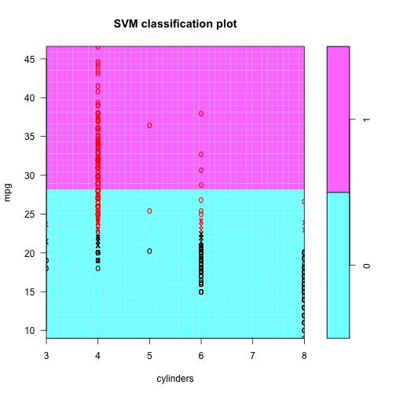 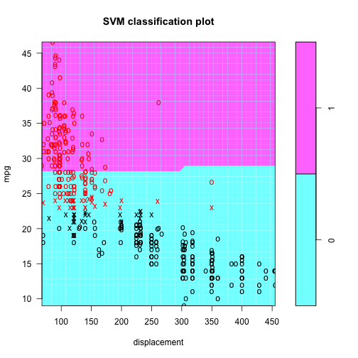 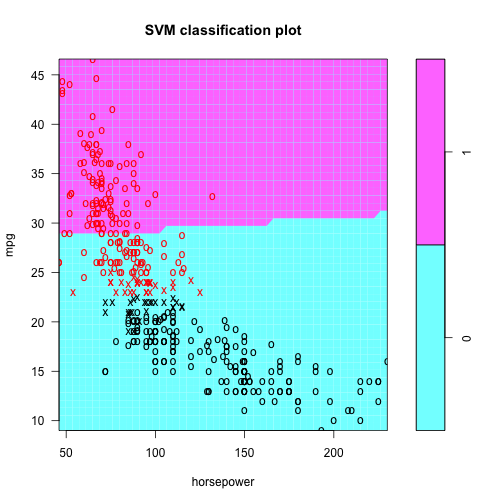 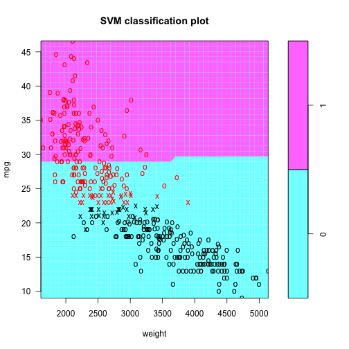 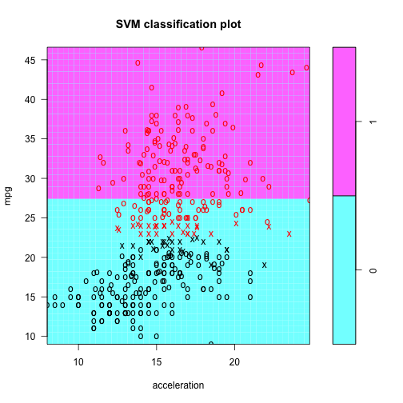 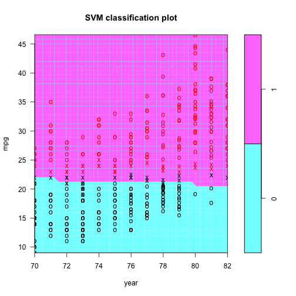 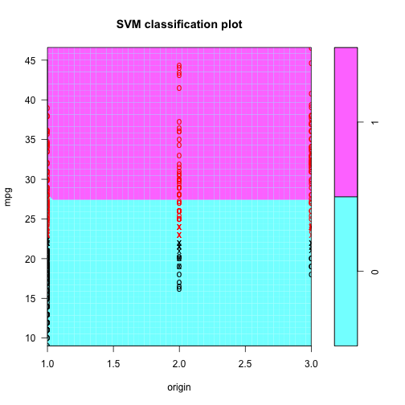 

```r
plotpairs(svm.poly)
```

 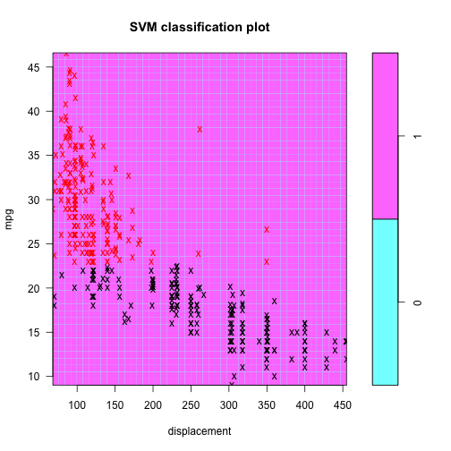 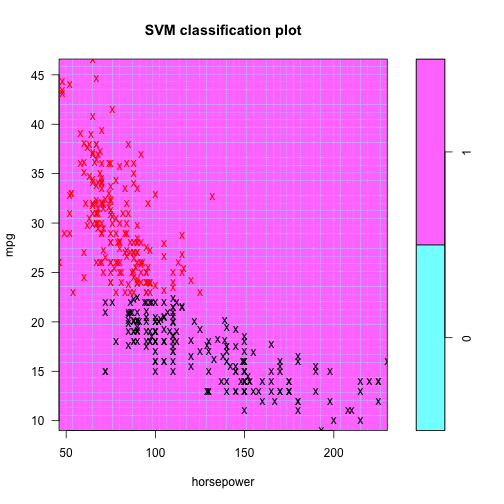 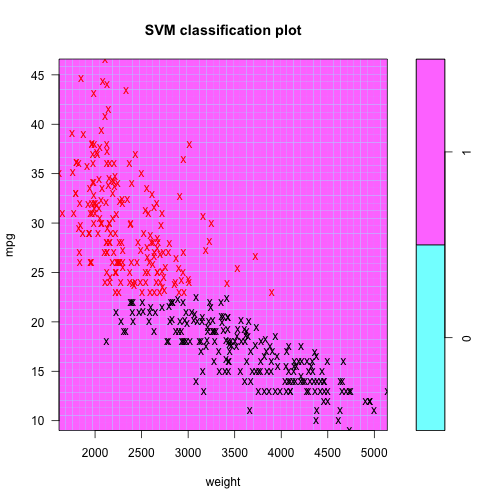 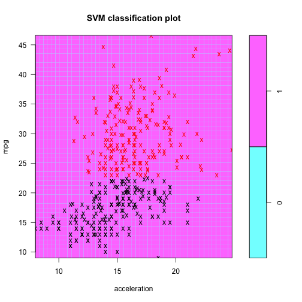  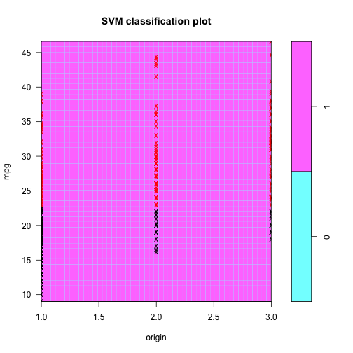 

```r
plotpairs(svm.radial)
```

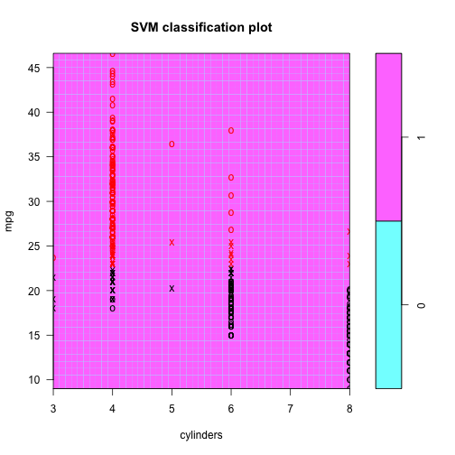 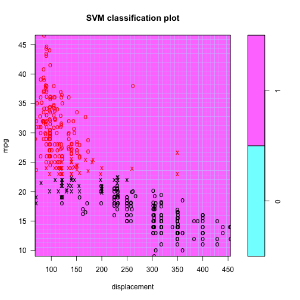  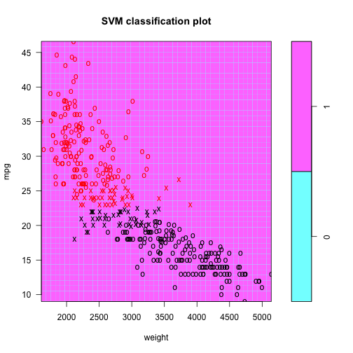 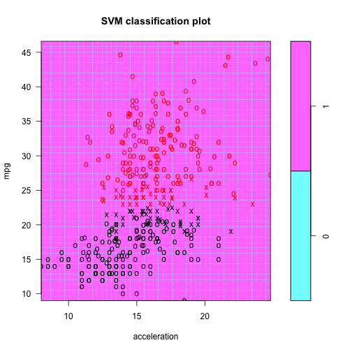 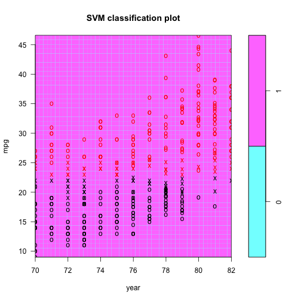  

